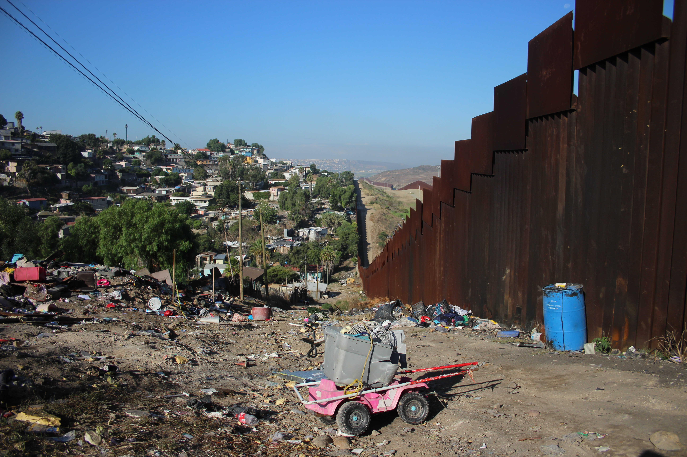
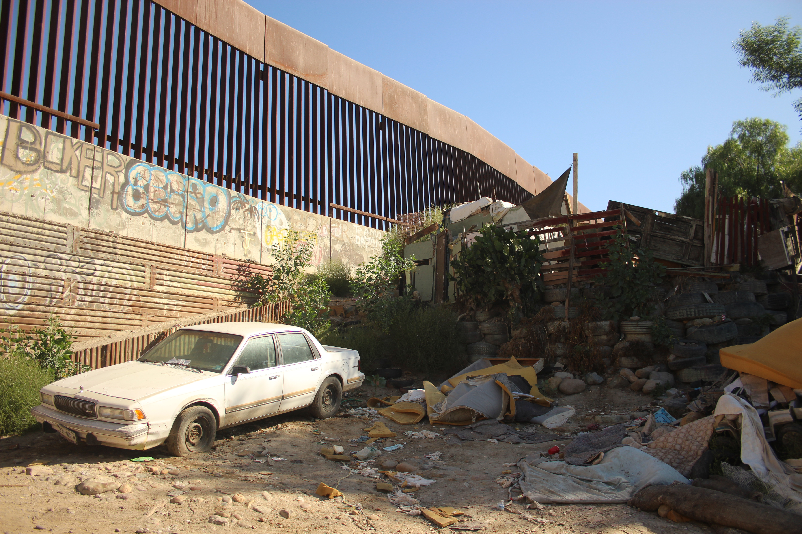
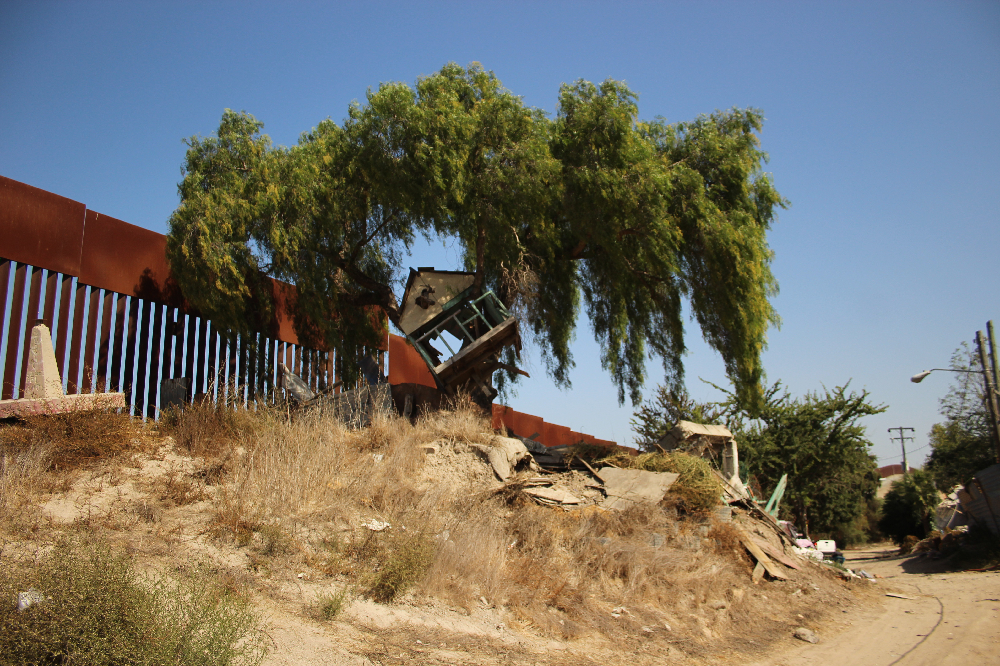
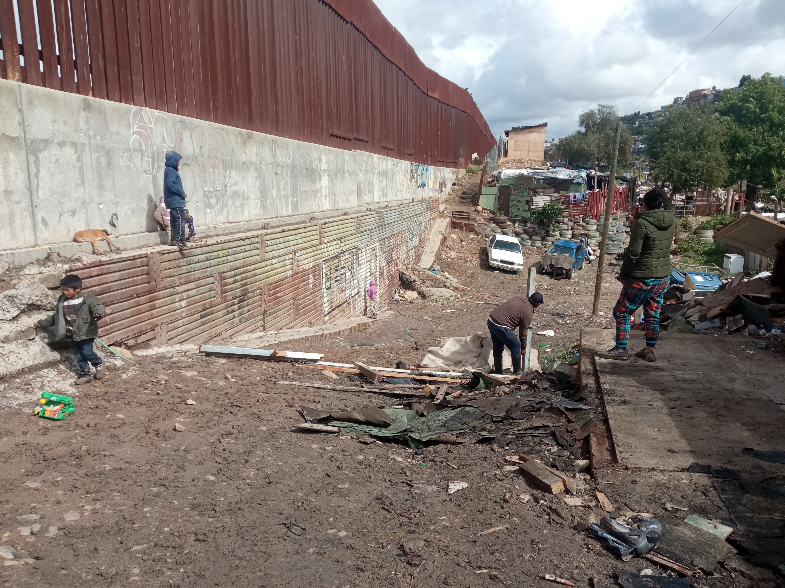
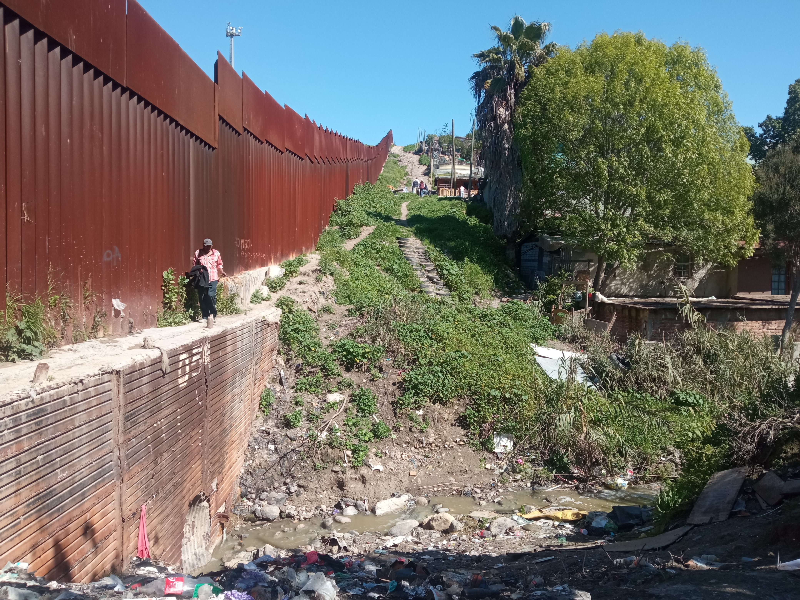
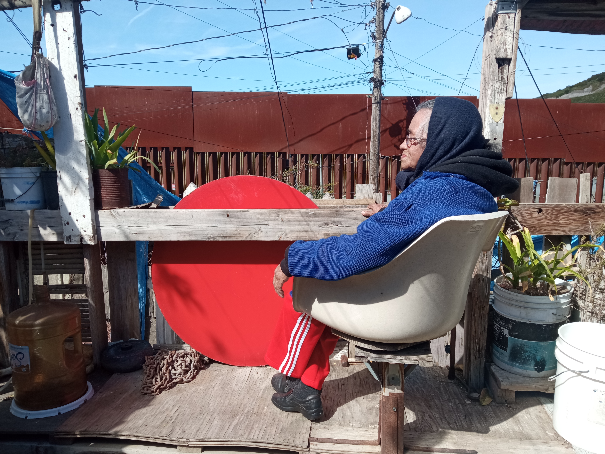

---
# Metadatos ESENCIALES del capítulo (no repetitivos)
pdf-engine: xelatex
title: "El borde de la colonia Libertad: la conciliación del Viaducto Elevado Tijuana 
en un entorno de violencia y olvido"
subtitle: ""
author:
  - name: "Virginia Ramírez Jiménez" #Aquí también va el nombre completo, no importa que se repita
    affiliation: "Universidad Iberoamericana, Ciudad de México"
    email: "bickyrmz@gmail.com"
    correspondence: true
    
# Metadatos ESPECÍFICOS del capítulo (no centralizables)
chapter-number: "6"
page-range: ""  # Ajustar según paginación final
doi: ""  # DOI del capítulo (cuando se asigne)

# Contenido del capítulo
resumen: |
  El presente artículo tiene como objetivo, comprender y analizar las dinámicas sociales y el valor simbólico que el muro fronterizo entre México y Estados Unidos de América (EUA), a la altura de la colonia Libertad en Tijuana, ha tenido para sus habitantes, y cómo ello influyó en la construcción de sus subjetividades. Esto se identificó durante los trabajos de campo para la socialización del proyecto Federal: "Viaducto Elevado Tijuana" en el 2023. Para comprender la construcción de sus subjetividades se recurre a las historias de vida como un recurso metodológico que dialoga con la categoría "borde", entendido como un espacio segregado de la colonia Libertad. También se observó cómo inciden los impactos materiales y afectivos en la implementación de megaproyectos en esta zona fronteriza, los cuales revelan la ausencia de políticas públicas desde la consolidación de la colonia Libertad.

keywords:
  - "Borde"
  - "Conciliación"
  - "Viaducto"

# Tipo de documento
type: chapter

---

\addtocontents{toc}{\protect\hspace{1.5em} Virginia Ramírez Jiménez \par}
\markboth{El borde de la colonia Libertad}{}
\begin{flushright}
\Large Virginia Ramírez Jiménez \footnote{Doctora en Antropóloga Social. Se enfoca en el estudio del trabajo sexual, los estudios de género, la diversidad sexo-genérica y los procesos de exclusión social. Su trabajo combina herramientas etnográficas y análisis sociocultural para comprender las experiencias, estrategias de resistencia y formas de organización de grupos en contextos de vulnerabilidad social. Contact: \href{bickyrmz@gmail.com}{bickyrmz@gmail.com}}
\end{flushright}

## Introducción {.unnumbered .unlisted}

Los hallazgos de este artículo son el resultado del trabajo de campo que realicé durante la socialización del proyecto "Viaducto Elevado Tijuana", una ambiciosa obra del Gobierno Federal, a cargo de la Secretaría de la Defensa Nacional SEDENA[^c6_1], que comenzó su construcción en 2023. Esta obra abarca la Avenida Internacional a la altura de la Zona de Playas, atraviesa el Cañón del Matadero, sigue su camino por Avenida Internacional, pasa a un costado de la Garita "El Chaparral", se reincorpora en la calle 2ª de la Colonia Libertad, pasa por Cañón Zapata, atraviesa el borde en la Avenida Vía de la Juventud y termina a la altura de la glorieta que conduce al aeropuerto internacional Abelardo L. Rodríguez.

El equipo encargado de la liberación de vía[^c6_2], conformado por tres abogados y una persona del área social[^c6_3], tenía la responsabilidad de socializar el proyecto en un lapso de seis meses (tiempo que se prolongó a 11 meses) y con ello, lograr la conciliación de 176 propiedades en condiciones legales complejas; algunas sin escrituras, con invasores, arrendadas o sin dueños. De estas se identificaron a un total de 147 propietarios que debían conciliar obligatoriamente con el Gobierno Federal. Aunque meses antes de comenzar la socialización del viaducto, otro equipo de trabajo realizó un análisis diagnóstico sobre la situación social y política de la colonia Libertad, la premura de los resultados subestimó el miedo de una posible expropiación y el valor simbólico que las y los propietarios afectados habían construido en torno al "borde", (categoría que se desarrollará más adelante) y el muro fronterizo. Estos fueron los indicadores que impedían concluir la conciliación.

Las charlas con los afectados permitieron identificar que el viaducto o "carretera" (como ellos le llamaban) se venía anunciando a finales de la década de 1960. Esto motivó a los propietarios a no invertir en construcciones o remodelaciones, sobre todo las personas de escasos recursos. En tanto que, quienes tuvieron el dinero y derechos jurídicos sobre su propiedad, invirtieron en su patrimonio, con la certeza de que el valor de su propiedad aumentaría debido a la cercanía con el aeropuerto y con Estados Unidos de América (EUA), pero no se imaginaron que un muro quebrantaría sus intereses y el valor económico de las propiedades.

La promesa sobre la construcción de una "carretera" que atravesaría la colonia Libertad se fue prolongando y con el paso del tiempo, hasta perpetuarse en un rumor. Aunque personas como "Rosita" (una mujer de 80 años) quedaron advertidas sobre la posibilidad de un megaproyecto que contemplaba abrir las calles... ella lo esperó desde muy joven.

> *(...) ¿Y usted sabe que por aquí va a pasar un viaducto?*
>
> ¡Sí! cuando éramos muy chamacos mi papá nos juntó a sus 15 hijos y nos dijo: "pues que van a abrir la calle". Él dijo que ya no le tocaría ver el puente. Nos dijo "me voy a morir antes de que pase eso". Se murió y no lo vio. Yo sé que también me voy a morir y no veré ese puente. Pero mi papá me dijo que lo que el gobierno dijera, se tiene que obedecer (...)"
>
> > Fragmento de diario de campo. Marzo 2023

La rapidez con la que el Gobierno Federal buscaba concluir la obra (antes de que el entonces presidente Andrés Manuel López Obrador terminara su mandato en el 2024) despertó descontento entre los propietarios afectados y vecinos de la Libertad, sobre todo en las familias con mayor poder adquisitivo. Amenazas vía telefónica, notas en prensa, evasivas durante las visitas y protestas fueron las acciones que los afectados emprendieron para evitar la construcción, algunas veces apoyados por personajes de la política local de Tijuana. Al reconocer el proyecto como un mandato presidencial, estos fueron cediendo poco a poco con la venta de sus propiedades. El enojo y la desconfianza mermaron cuando se percataron que el Gobierno Federal no los expropiaría y que "les pagaría bien", aunque la liberación de vía no contempló reubicación.

El trabajo de campo para la socialización del viaducto en Tijuana se desarrolló en un periodo de once meses: de febrero a noviembre del 2023. Se priorizaron recorridos diarios (solo en el "Tramo III") en diferentes horarios: entre las 8 de la mañana y hasta las 5 de la tarde. Este horario se fijó considerando las advertencias de los habitantes del lugar, después de esa hora la integridad del equipo corría bajo su propio riesgo. La molestia de los 147 afectados quienes estaban obligados a conciliar, implicó paciencia y escuchar con atención los motivos por los que estos pedían cambiar la ubicación del viaducto, petición que no podía concederse. Los registros en diario de campo y las entrevistas dieron como resultado historias de vida; genuinamente estas fueron las herramientas que llevaron al equipo a puntualizar en las necesidades de cada propietario, permitiendo construir diversas narrativas para lograr la conciliación y con ello concluir la liberación de derecho de vía.

Para el registro de las historias se entrevistaron a 30[^c6_4] de 176 afectados. Aunque se lograron construir lazos de confianza con más propietarios, la mayoría prefirió no participar en entrevistas a profundidad, aunque eso no les limitó a contar sus vivencias, las cuales fueron registradas en el diario de campo. Por motivos de seguridad, los nombres de las personas que participaron en las entrevistas fueron modificados. Dentro del artículo se integra la interpretación del espacio a partir de la categoría "borde", no solo como una localización geográfica, sino como un cúmulo de experiencias que se desarrollan en contextos precarios marcados por la pobreza, violencia y desigualdad.

Aunque existe un debate por el uso de la escritura en primera persona en los textos de carácter antropológico, a lo largo del artículo se podrá apreciar mi intervención en algunos fragmentos que corresponden al diario de campo. Esto responde a que, a lo largo de 11 meses, fue inevitable no incidir en las dinámicas de las y los propietarios; inevitablemente fui una sujeta activa que escuchó y registró sus vivencias personales, las cuales son el resultado de la confianza que estas personas me brindaron. El omitir mi participación sería no reconocer que, fui un instrumento del megaproyecto que también afectó su cotidianidad.

Finalmente, este artículo no busca desprestigiar el proyecto "Viaducto Elevado Tijuana", porque para algunas personas (sobre todo de escasos recursos) el conciliar con el gobierno fue una posibilidad de acenso y de mejora en sus vidas. Este escrito pretende registrar que los impactos de megaproyectos de infraestructura como el viaducto, permiten observar problemáticas sociales y políticas que no fueron atendidas décadas atrás. Esto permitió a sus habitantes resignificar elementos violentos como lo es el muro entre EUA y México; ya sea a través de buenas o malas experiencias, el muro es parte de su identidad como personas fronterizas.

## El proceso de socialización y los Indicadores sociales en el borde de la colonia Libertad[^c6_5] {.unnumbered .unlisted}

Para una mejor comprensión de la magnitud del Viaducto Elevado Tijuana, es necesario mencionar datos técnicos[^c6_6]. Esta construcción tiene una vialidad de 10 kilómetros y conectará el Aeropuerto Internacional de Tijuana con la zona de Playas de Tijuana, facilitando el flujo de vehículos que ingresan y salen del país por los cruces fronterizos adscritos a la Aduana de esta ciudad. El viaducto también complementa una red de carreteras y un enlace a la Garita de "El Chaparral" y "Puerta México". Favorecerá la circulación de los vehículos que se dirijan a la Aduana de la ciudad de Tecate en el lado este, y Ensenada al oeste, a través de la autopista Tijuana - Rosarito, agilizando la movilidad del tránsito del comercio exterior.

Por cuestiones de estrategia operacional, el viaducto se dividió en tres tramos: el "Tramo I" abarca de la zona de Playas de Tijuana hasta la altura del Cañón del Matadero; el "Tramo II" atraviesa la Avenida Internacional pasando a un costado del centro de Tijuana, hasta llegar a la altura de "El Chaparral". Finalmente el "Tramo III", comenzó en la "Calle 2ª" de la colonia Libertad, hasta la glorieta del Aeropuerto Internacional de Tijuana; fue en este tramo donde se implementó la socialización del viaducto, ya que había personas asentadas.

El proceso de socialización encaminado a la liberación del derecho de vía se desarrolló en tres etapas. La primera fue la identificación de la zona y el reconocimiento de autoridades y propietarios afectados. Durante esta etapa se hicieron recorridos para familiarizarse con el lugar. Se aplicaron cuestionarios para obtener los datos personales de las y los propietarios y poseedores afectados, identificando la situación legal de sus propiedades.

La segunda etapa incrementó los recorridos en campo y las visitas diarias en atención a propietarios y poseedores. En cada visita el equipo se apoyaba de un "plano de afectación", informando al propietario que su propiedad era afectada por el viaducto. Se priorizó la atención individual para informar sobre las opciones de conciliación. Se entabló un acercamiento con los lideres de la colonia para informarles el listado oficial de los afectados, con la finalidad de legitimar al equipo de liberación de vía y buscar un acercamiento con los vecinos de la colonia Libertad. Se atendieron las manifestaciones de propietarios con postura negativa y se convocó a reuniones para escuchar sus peticiones. Se construyó una agenda de medios para socializar el proyecto en la prensa local y estatal; dicha agenda se configuró con las percepciones, dudas y sugerencias de vecinos y afectados de la colonia Libertad.

Finalmente la tercera etapa comprendió el cierre de las conciliaciones y la toma de posesión de los predios involucrados. Este proceso incluyó la indemnización de la tierra, el avalúo de la construcción y el avalúo de los Bienes Distintos a la Tierra (BDTS). Durante la conciliación al propietario/poseedor se le informó que el costo de su propiedad se estableció conforme al tabulador del INDABIN[^c6_7]. Respecto a los tiempos de desocupación y de mudanza, estos fueron establecidos el equipo de liberación de vía. A las personas que no contaban con documentación, se les acreditó la calidad de propietarios y se les brindó una solución para conciliar. No hubo desalojo, pero tampoco reubicación para ningún afectado.

Durante los recorridos diarios en el "Tramo III", se observaron los cambios y las dinámicas sociales que se desprendían durante el proceso de socialización. Esto permitió identificar los rezagos sociales y económicos de las familias, sobre todo de aquellas que habitaban muy cerca del muro fronterizo.

{#fig-1 fig-align="center" width="85%"}

La pobreza y desigualdad que les caracterizaba se contrastó con los indicadores del @CONEVAL2012 a través de la "Metodología para la medición multidimensional de la pobreza en México"[^c6_8]. Este ejercicio tenía como finalidad, abonar a las estrategias de conciliación a través de los avalúos de las propiedades. Los indicadores que a continuación se presentan, permitieron identificar que, personas del borde de la colonia Libertad vivían en condición de pobreza extrema:

a)  **Por ingresos**: el 40% de las familias afectadas no contaban con recursos suficientes para adquirir los bienes y servicios que se requieren para satisfacer sus necesidades (alimentarias y no alimentarias).

b)  **Por rezago educativo**. Los "jefes de familia" tenían como grado máximo de educación la secundaria.

c)  **Calidad del espacio.** El 50% de las propiedades en las que habitaban estas familias se construyeron de madera reciclada, con pisos de cemento y tierra.

d)  **Acceso a servicios básicos.** Las familias que habitaban en Avenida Vía de la Juventud y Cañón Otay Parte Alta no tenían sistema de drenaje, agua potable y electrificación pública.

e)  **Del contexto territorial**. El borde de la colonia libertad destacaba por ser un lugar no pavimentado; en el caso de los vecinos de la Avenida Vía de la Juventud, estos habitaban a un costado del canal de desagüe. Esa parte de la colonia Libertad se considerada "zona de paso de polleros". Durante el mes de mayo del 2023 se encontró un narco túnel en uno de los predios involucrados y semanas después el dueño fue asesinado a unas calles de su propiedad. Durante el mes de mayo y septiembre, dos posesionarios involucrados en el Proyecto fueron asesinados dentro de sus hogares por motivos

## Contexto histórico de la colonia Libertad {.unnumbered .unlisted}

Uno de los elementos que dio pie al nacimiento de la colonia Libertad fue la ausencia de la intervención del gobierno. De acuerdo con los datos obtenidos en el Acervo Histórico de Tijuana[^c6_9], la consolidación de esta colonia también responde a la intervención militar. Las aportaciones del sociólogo Jorge A.  @Bustamante1990, explican que la fundación de la colonia Libertad nace del movimiento obrero de 1920, encabezado por los trabajadores que participaron en la construcción y operación de los servicios del viejo Hipódromo, espacio que albergó los primeros casinos en esta ciudad fronteriza.

El crecimiento económico de Tijuana llamó la atención de personas extranjeras, sin embargo la expansión económica de esta ciudad comenzó a quedar en manos de empresarios y consumidores extranjeros. Bustamante explica que el contraste era dramático: los clientes del lujoso casino *Agua Caliente* incluían estrellas de Hollywood, personajes de la nobleza europea y exiliados de la primera guerra mundial. En cambio, los mexicanos sólo habitaban los casinos para atender a esos extranjeros.

La gentrificación de la vieja Tijuana motivó a los trabajadores del casino Foreign Club, Casino Agua Caliente, trabajadores del gremio de choferes, trabajadores de la CROM y sindicalizados de la Liga Nacionalista, a iniciar un movimiento bajo el lema: "Quien vive en Tijuana, en Tijuana debe trabajar". En 1927 y 1928 comenzaron las juntas sindicales, destacando la participación de Manuel Lerma, un indígena Yaqui de Sonora.

Como parte de las iniciativas del movimiento, Manuel Lerma propuso que los trabajadores se asentaran en las caballerizas del viejo hipódromo y en los jacales de madera donde vivían los jinetes. Este lugar estaba cercano a la antigua vía de ferrocarril, debajo de lo que ahora es la colonia Libertad. Manuel Lerma ya había explorado la zona y sabía que las caballerizas estaban abandonadas: "los caballos vivían en mejores condiciones de habitación que la mayoría de los trabajadores de Tijuana; en construcciones techadas cerca del hipódromo" [@Bustamante1990: 12].

Para ese entonces ya se había formado el Sindicato de Pequeños Poseedores, teniendo como miembros a trabajadores que necesitaban de una casa. En 1929 se registró la primera invasión: Manuel Lerma convenció a veinte familias de tomar las caballerizas abandonadas, bajo la justificación de que: "los obreros tenían derecho a tomar estos espacios porque ya los habían pagado con su trabajo y al estar en abandono, tenían el derecho a ellas por haber contribuido con su esfuerzo laboral" [@Bustamante1990: 13]. Al percatase de la invasión, los dueños del hipódromo buscaron la forma de asegurar sus propiedades, dando aviso al General Manuel Tapia, quien dio la orden de desalojar a las familias que se habían apropiado de las caballerizas abandonadas. Este evento provocó que el Sindicato de Pequeños Poseedores fuera perseguido y buscado tanto en México como en EUA.

La persecución que sufría este grupo de trabajadores y sus familias llamó la atención de otros obreros de Tijuana, quienes se sumaron a la lucha. En esas condiciones se formó otra comisión para dirigirse con el General Arturo Bernal, quien había sustituido al General Tapia. El objetivo de esa comisión era lograr el apoyo del nuevo General para que las familias del Sindicato de Pequeños Poseedores pudieran establecerse en las viejas caballerizas. Arturo Bernal decidió apoyarlos poniendo fin a la persecución.

Los Pequeños Poseedores organizaron expediciones a los basureros en busca de material para construir sus viviendas. Domingo García, autor del nombre "Libertad", sugirió contratar a un ingeniero para diseñar el trazo de lo que sería la colonia. Bustamante puntualizó que, en ese plano se dibujaron los lotes en figuras regulares de 16 x 45 metros, con los nombres de las familias que los ocuparían.

{#fig-2 fig-align="center" width="85%"}

La primera piedra se colocó en 1930. El dibujo del trazo, la alineación de calles, la distribución de lotes, la construcción de viviendas y la provisión de servicios fue iniciativa de particulares. La colonia Libertad se expandió tras la llegada de mexicanos que fueron expulsados de Estados Unidos durante la década de los treinta, familias que decidieron asentarse en la colonia Libertad para mantenerse cerca de los EUA.

Este pasaje histórico, autoría de Jorge @Bustamante1990 continúa presente en la identidad de quienes viven en la colonia Libertad, asumiéndose como personas que luchan. Sin embargo ese ímpetu se disipa horizontalmente; el crecimiento de esta colonia fue desigual. Esa desigualdad se alberga en un espacio segregado marcado por el muro entre México y EUA, al que en este artículo se le denominará "borde", espacio que continúa siendo el refugio de familias migrantes de escasos recursos.

## Apartado metodológico: la categoría borde y la importancia de las historias de vida {.unnumbered .unlisted}

Las características espaciales y de interacción social que se configuraron en el tramo de la colonia Libertad afectado por el viaducto, deben entenderse desde la categoría *borde*, un espacio geográfico entre los límites de México y EUA. Lo particular de este borde es que, este se impuso en la cotidianidad de sus habitantes, tras la construcción del muro. Para comprender la propuesta central de este artículo, dialogaré con las aportaciones de autores que brindan interpretaciones de la categoría borde, entendido no solo como un espacio geográfico que adquiere valor simbólico dependiendo del momento histórico en el que se aborde, sino que va configurando un cúmulo de experiencias que, en su mayoría, se desarrollan en contextos precarios.

Autores como Santiago Castro Gómez entienden la frontera/borde como: "(...) la zona intermedia, o el espacio entre dos mundos que surge de un encuentro asimétrico (...) forjando un sistema de jerarquías" [@Castro2007: 12]. Para Castro Gómez los bordes son el resultado de los proyectos de modernidad, en los cuales las y los sujetos tienen a reconfigurar sus dinámicas para resistir a los cambios y a la imposición de nuevas jerarquías.

La socióloga Mariana Wagner explica que: "(...) la construcción de bordes engendra un sentido en las personas de estar dentro o fuera de un lugar (...) los bordes concretizan el territorio y lo que estos territorios significan. Los bordes señalan, y a la vez unen y contienen: personas, ideas, prejuicios, formas de vida, bienes, sistemas, etcétera" [@Wagner2016: 180]. Esta idea me lleva a retomar las aportaciones de Walter Mignolo y el surgimiento de nuevas epistemologías en los bordes, esto como resultado de los procesos de modernización que construyen y albergan nuevas experiencias que se van interiorizando en las personas, lenguajes, religiones y conocimientos. Mignolo resalta la importancia "(...) no solamente de entender el borde como un espacio geográfico, sino también como nuevas formas de política, subjetividades y epistemes" [@Mignolo2015: 315].

Esta idea dialoga con las experi  encias de los habitantes que permanecían/permanecen en el borde de la colonia Libertad. Personas que configuraron sus subjetividades y cotidianidades conforme a los cambios físicos del muro fronterizo, construyendo sus lógicas de pensamiento desde un espacio lleno de desigualdad, pero que enaltecían por el hecho de vivir a escasos metros del país vecino. Por ello la importancia de registrar sus historias y sus vivencias, porque estas permitirán comprender sus entramados sociales en diferentes momentos históricos. Esto me lleva a retomar el trabajo del antropólogo Guillermo Alonso Meneses, quien desarrolló los hechos que posibilitaron la construcción del muro como se le conoce internacionalmente:

> (...) fue a finales de 1989 cuando los grupos de civiles, jubilados y veteranos molestos por "el caos" que les causaba la migración en los límites de San Diego, impulsaron la campaña *"Lights up the Border".* La repercusión mediática que tuvo la acción de estos vigilantes fronterizos y su odio hacia los mexicanos permitieron la construcción del muro metálico con el fin de contener el flujo migratorio. En 1991, la administración del entonces presidente de EUA, George Herbert Walker Bush, comenzó a levantar una barda de acero entre la playa de Tijuana y la Garita de San Ysidro; para su construcción se utilizaron planchas metálicas de 2.4 metros de altura dispuestas en vertical: plataformas viejas y oxidadas para helipuertos portátiles y caminos que se ensamblaban, usadas en la guerra de Vietnam hasta 1975" [@Meneses2023: 265].

El muro que divide México de EUA no solo se trata de una barrera física que impide el paso de migrantes, o que intenta "proteger" al país vecino de agentes extraños[^c6_10] [@Simmel2014a]. El muro como un dispositivo de control [@Foucault1976] construyó narrativas de distinción que reafirman la supremacía blanca, su ideología de superioridad racial, social y económica frente a los países del sur[^c6_11].

El análisis cualitativo de los datos contempló las historias de vida como el recurso metodológico para abordar e identificar las problemáticas y el sentir de las y los propietarios afectados. Sus historias permitieron conocer e interpretar la realidad del borde de la colonia Libertad, identificar el valor simbólico que construyó sus subjetividades y cómo el muro fronterizo había influido en su cotidianidad. Por esto se recurre a las aportaciones del sociólogo Franco @Ferrarotti2012, quien describe las historias de vida como un método cualitativo que involucra la confianza y la construcción de empatía entre interlocutores y el investigador:

> es justo la comprensión profunda, y no sólo a la descripción de los contornos externos, para lo que sirven las historias de vida (...) estas tienen un precio que obligan a ganarse la confianza de los interlocutores (...) ayudan a comprender que la persona que investiga también es "investigado" [@Ferrarotti2012: 17].

En tanto que, las historias de vida como método cualitativo brindan un marco interpretativo que da sentido a las experiencias humanas. A través de los relatos personales de las y los afectados por el Proyecto Viaducto Elevando Tijuana, se logró entender sus acciones: su rechazo en contra del proyecto o su interés por vender sus propiedades. Los datos obtenidos en las historias de vida permitieron analizar cómo era su relación con el borde de la colonia Libertad y el significado le daban a su cotidianidad a partir de la transformación geográfica, física y social de este espacio, todo en relación con el muro fronterizo.

Al identificar el valor histórico de los relatos, me permití continuar con el registro de las historias, con el fin de preservar la memoria colectiva de las personas que, involuntariamente, construyeron/habitaron el borde de la colonia Libertad y que se vieron en la obligación de vender sus hogares.

{#fig-3 fig-align="center" width="85%"}

## La construcción del Borde de la colonia Libertad {.unnumbered .unlisted}

Fueron los relatos de las y los propietarios los que permitieron identificar que, antes del muro, el borde albergaba un sentimiento de fraternidad entre los migrantes, los colonos de la Libertad y la policía americana. También se identificó que los trabajos precarios[^c6_12] como el del "pollero" surgió como una alternativa de empleo, idea que se desarrollará más adelante. Para el propietario "Osvaldo", vivir su infancia en el borde le permitió habitar la frontera de forma lúdica, aunque también permitió identificar la consolidación de las dinámicas comerciales de la colonia Libertad en un espacio donde no había muro:

> (...) Allá donde vivimos nosotros ¿si te acuerdas?
>
> *Sí, antes de llegar a la glorieta del aeropuerto.*
>
> Bueno pues cruzando del otro lado, cuando no había muro, antes allí había un cerro, aunque los gringos ya lo rebajaron todo. Por allí se estrelló una avioneta. Me acuerdo que, me tocó ver los cuerpos sin cabeza ¡Se miraban bien feos!
>
> *Me imagino fue una sensación terrible...*
>
> Sí pues miré todos degollados. Esa avioneta (...) como era de aluminio la gente se llevó todo para venderlo. Haga de cuenta que en la parte de abajo (Avenida vía de la Juventud) había un tianguis en donde se vendían cosas para los polleros y para las personas que cruzaban, pues allí se vendieron los restos de la avioneta. Eso fue en 1987, fue noticia nacional.
>
> *¿La avioneta es el acontecimiento qué más recuerda?*
>
> ¡Hay bastantes historias!, sobre todo cuando antes se podía cruzar. Nos pasábamos para jugar en el campo de fútbol que estaba del otro lado. Todavía en 1989 pasamos el cerco para jugar y nos regresábamos cuando nos cansábamos. A veces los migras nos miraban cruzar, pero sólo nos saludaban y se acabó. No nos decían nada. Lo más que hacían los migras eran tipos redadas: llegaban a ese tianguis que te digo y la gente se salía corriendo, abandonando sus puestos. Aunque las redadas no eran frecuentes.
>
> *¿Era peligroso vivir por este lado de la colonia?*
>
> Fíjate que antes no había tanta violencia como ahorita. Lo que había aquí era que asaltaban mucho a los polleros. Antes aquí vivía un tipo que se llamaba "Canelo" ¡a ése cómo le gustaba asaltar a los pollos...hasta los golpeaba! Yo tenía como once años cuando vi que los pollos se agarraban a balazos, hasta que mataron al Canelo. Aquí ser pollero era un trabajo, pero ahora los polleros se sienten mucho. Si les dices algo casi te matan. Mira, problemas de ese tipo siempre hubo. Pero yo viví mi infancia muy feliz en este lugar (...)
>
> > Fragmento de entrevista. Agosto 2023

Las historias de los vecinos afectados permitieron identificar que, el borde fue adquiriendo vida por el fenómeno de la migración, esto llevó a los habitantes de la colonia Libertad a emprender negocios enfocados en facilitar el paso de las personas que cruzaban a los EUA a trabajar. Este es el caso de "Margarita", quien formó su patrimonio vendiendo comida a migrantes.

> (...) estaba yo acostada preguntándome qué haría porque cuando llegué a Tijuana (...) solo traía para que mis hijos no se murieran de hambre. Cuando de repente pasó un señor diciendo: ¡pollo, pollo! Él traía bolsitas con pollo del otro lado. En ese entonces la gente pasaba por el cerro y pues traía cosas gringas para vender y ese señor traía pollo. Le compré dos bolsitas que eran de seis libras cada una. Ese mismo día saqué un bracero, puse el pollo en el carbón, compré verduras, saqué mi mesita y así comencé. ¡En un ratito vendí todo el pollo!
>
> *¿Entonces había mucha gente por aquí?*
>
> ¡Huy sí! ¡Aquí hervía de gente? Al otro día traje más carne, más pollo. Las mismas personas me ayudaban a sacar las cosas y a poner el puesto porque tenían hambre. Era pura gente mexicana que quería ir del otro lado y como no había muro pasaban rápido ¡montones que pasaban! No había cerco, no había nada. Antes esto estaba lleno de gente. Ahora está solo. En ese entonces había una arboleda en vez de muro ¡bonitos los árboles! Venía la gente y se acostaba debajo de ellos. Pero después de que pusieron el muro agarraron toda la calle y tumbaron los árboles. Ahora nadie pasa, está solo.

Las vivencias expresadas por las y los habitantes de la colonia Libertad hacían referencia a las dinámicas que mantenían con EUA cuando "no había frontera": se cruzaba para jugar béisbol en el campo, para lavar ropa en el arroyo o para trabajar en San Diego. Todas y todos cruzaban; la decisión de regresar a México dependía de la voluntad de cada persona y no de un trámite legal. "Juanita", una mujer de 67 años narró la forma en la que llegó a Tijuana y construyó su casa con la basura que tiraban en el espacio donde ahora está el muro de acero.

> *"(...) En la búsqueda de mejorar su calidad de vida, Juanita migró con su marido de Nayarit a Tijuana en julio de 1969. Ella tenía 13 años cuando contrajo matrimonio con Gabriel, su difunto esposo, quien en aquel entonces le llevaba ocho años. Al año siguiente comenzó su ciclo de maternidad; sólo tuvo tres hijos.*
>
> No recuerdo exactamente el año en que llegamos a Tijuana. Sólo sé que fue en el mismo año que el hombre llegó a la luna. ¡Lo recuerdo porque se hizo un alboroto!
>
> *Dice que Gabriel trabajaba como cargador de costales de azúcar y desde ese año comenzaron a vivir en la colonia Libertad. Sin embargo y tras el permiso de un conocido, Juanita, Gabriel y sus tres hijos comenzaron a vivir frente al país vecino, en el borde, mucho antes de que el territorio fuera dividido por un muro.*
>
> En esa fecha llegamos con mi suegra, allí por el cañón Emiliano Zapata, pero duramos poquito tiempo porque mis niños venían chiquitos y no tenían dónde correr. Mi concuño era migrante y él fue quien compró aquí, pero ya murió. Nos dijo que nos fuéramos a cuidar la casa y así llegamos. Antes sólo había un cuartito y todo esto (señala con las manos) estaba lleno de *caiditos*[^c6_13] *todos rascuachitos*[^c6_14] como la casa. No teníamos luz, no teníamos agua, no teníamos nada (...) aquí estaba todo destapado, no había divisiones, ni muros ¡hasta mis hijos jugaban al otro lado ¡Primero echaron un muro de lámina y ahora ese muro! Antes esto era un basurero y como pudimos se fue levantando la casita pa´ caber, porque no cabíamos: madera, lámina, cemento. Todo lo que encontrábamos en la basura lo ocupamos para hacer nuestra casita (...)"
>
> > Fragmento de entrevista. Junio 2023

Florencia fue otra de las vecinas que llegó a vivir en el borde cuando el territorio era "solo uno". La mujer reconoció que, pese a lo solitario de la zona, durante la década de los 70´s pocas veces se veían episodios de violencia, aunque era la pobreza era lo que delineó las dinámicas de ella y de sus vecinos:

> Cuando yo llegué nomás había una cerquita de alambre, pero podías pasar con los gringos y nadie decía nada. Como allí tiraban los desperdicios las fábricas y nosotros estábamos bien jodidos, mi esposo sacaba la madera de la basura y comenzó a hacer una escalera para la casa. Pero fíjese que antes no había tantos muertitos ni nada, había mucha paz. Yo me acuerdo que, en ese entonces toda la gente salía a platicar en donde ahora está el muro, ahora está vacío. Ni un alma (...)
>
> > Fragmento de entrevista. Mayo 2023

{#fig-4 fig-align="center" width="85%"}

## Patrimonio irregular: violencia e incertidumbre {.unnumbered .unlisted}

Las y los vecinos explican que en el borde de la Libertad no pasaba mucho y que la intervención del Gobierno Local y Federal sólo era visible en campañas electorales. Retomando los aportes del sociólogo Jorge Bustamante, él explica que un elemento muy significativo del nacimiento de la colonia Libertad respondió a la ausencia y falta de intervención del Gobierno: "(...) tanto el trazo y alineamiento de las calles, la distribución de los lotes, la construcción de las viviendas y la provisión más elemental de servicios, fueron iniciativa y logro de particulares organizados para beneficio de su propia comunidad. No hubo "decisiones de arriba" en la creación de la colonia. Fueron la determinación, la solidaridad y la conciencia nacionalista de "los de abajo", los ingredientes principales de la colonia Libertad" [@Bustamante1990: 13].

En tanto que los hallazgos del sociólogo Jorge Negrete [@Mata1993], puntualizan que, entre la década de 1950 y 1970 el crecimiento de Tijuana está catalogado como uno de los más acelerados del país. En veinte años, esta ciudad definió su perfil socioeconómico a partir de la predominancia del comercio, los servicios turísticos y la consolidación de una industria propia. Su cercanía con EUA le permitió desarrollar empresas trasnacionales en donde predomina la industria maquiladora, la cual dirigió el proceso de industrialización de Tijuana, representando una oportunidad laboral para personas de todo el país.

La toma de decisiones y la politización del espacio por parte de los gobiernos en turno[^c6_15] fueron factores que endurecieron la desigualdad social en Tijuana. Continuando con las aportaciones de Jorge Negrete, este explica que Tijuana se construyó en medio de muchos problemas vinculados con la propiedad del suelo urbano: invasiones propiciadas o permitidas por el gobierno, rescate de zonas invadidas, reubicación, desalojos o permutas de suelo invadido por terrenos habilitados [@Mata1993]. Este fue el motivo por el que los propietarios afectados en el viaducto temían de una "expropiación", porque históricamente la expropiación en Tijuana ha sido un instrumento político que ha permitido el reordenamiento urbano de la ciudad. En tanto que su condición como poseedores sembraba miedo e incertidumbre sobre su porvenir.

La segregación espacial del borde se agudizó con el paso migratorio. Para autores como Ariel Espino, las divisiones y segregaciones responden a la lógica del sistema y a los resultados del libre mercado: "los desarrolladores construyen vecindarios de distintos niveles económicos y los compradores se distribuyen en el espacio urbano según sus ingresos" [@Mendez2018]. Por ello el borde de la colonia Libertad tiene las características de un territorio segregado, en el que aún habitan/habitaban familias con índice de pobreza extrema. Paradójicamente las familias más pobres de este lugar vivían a escasos metros del país más rico del mundo.

La resignación de las y los propietarios les llevó a familiarizarse con el equipo de liberación de vía, permitiendo las primeras negociaciones; las personas en condición de pobreza fueron las primeras en conciliar. Aunque las y los propietarios reconocían que el Gobierno Federal les estaba "pagando bien", al entablar conversaciones más profundas y tras un sinfín de visitas, se identificó que los motivos por los que no querían irse del lugar, pese a la inseguridad y la violencia que se vivía por ser "zona de polleros", era que la cercanía con EUA les daba "estatus", en comparación con otras colonias populares de Tijuana, como "El Florido":

> (...) yo digo que la ventaja de estar aquí, en la Libertad, pues casi, casi estamos bien céntricos y cerca de los gringos. Y fíjate qué bueno que estamos hablando de esto. ¡Qué caro está Tijuana! ¡Yo me estoy quebrando la cabeza! Duermo bien tarde, estoy revisando lugares y casas. Yo me digo ¡No me va a alcanzar, está caro! ¡No te puedes imaginar! ¿Dónde voy a encontrar un lugar así de cerquita de los United States (...)
>
> > Fragmento de entrevista de "Emanuel", mayo 2023

Las y los propietarios afectados de escasos recursos, quienes nunca habían cruzado a los EUA y mucho menos contaban con una Visa, enaltecían vivir frente al país más poderoso del mundo, lo que les permitía construir un sentimiento de orgullo por vivir en el borde de la colonia Libertad: se sentían privilegiados aunque hubiera un muro de por medio. En cambio, otros propietarios en la misma situación económica habían cambiado de parecer cuando las dinámicas de violencia en la zona repercutieron en su cotidianidad, pero su pobreza no les permitía mudarse a otro lugar y desconocían la existencia de apoyos institucionales. Esto se identificó en dos casos de mujeres; "Rocío" de 60 años que había perdido la vista a consecuencia de la diabetes, explicaba que la ubicación de su casa era el factor que impedía a las instituciones sociales de Tijuana hacer enlaces en materia de política social:

> *(...) - ¿Quiere hablar sobre la muerte de su esposo?*
>
> Sí, no hay problema. Ya pasó.
>
> *¿Quiere contar en dónde falleció su esposo?*
>
> Allá adelantito, por donde vive doña "Rosita", por ese rumbo. Lo balacearon. No se supo el por qué. Ya ve que, si uno no tiene dinero, no investigan. Nada más lo balacearon y no aguantó los balazos por eso falleció. Un vecino vino a hablarle a mi hija pues porque yo no podía salir y vinieron a avisarle para que le hablaran a la ambulancia. Cuando la ambulancia llegó se lo llevaron vivo, pero dicen que en el hospital falleció.
>
> *¿Entonces nunca supieron quién fue el responsable?*
>
> No, nunca supimos. Y pues no queremos porque ya ve que es un área peligrosa. Vale más vivir así, en paz, sin saber quién fue.
>
> *El muro que divide la frontera con Estados Unidos forma parte del patio de "Rocío". Es curioso ver la facilidad con la que sus perritos y gallinas atraviesan el muro y cruzan al país vecino en busca de comida o sombra para echarse, pero sus animalitos siempre regresan. La casa de "Rocío" también está a unos pasos del lugar donde se encontró un narco túnel. La mujer explica que la cotidianidad alrededor de su casa siempre ha involucrado el paso de migrantes, aunque dice que con el paso del tiempo las cosas han empeorado.*
>
> *¿Tiene miedo de vivir aquí?*
>
> No, ya me acostumbré (ríe). Pero ya uno qué puede hacer, más que oír y callar. Encerrarse más que nada. Mis perritos me avisan cuando pasa alguien, son bien escandalosos por eso sé cuándo alguien pasa afuera de la casa. Luego pasan corriendo por el techo. Son los migrantes, los polleros. Yo ni salgo (...)
>
> > Fragmento de entrevista. Junio 2023

Para propietarias como "Paola", la construcción del segundo piso representó una posibilidad de mejorar la calidad de vida de su familia, sobre todo tras la pérdida de uno de sus hijos; un joven de 21 años asesinado a la misma altura donde el esposo de "Rocío" fue baleado, lo que permite identificar las dinámicas de violencia que se desprenden en el borde por ser paso de migrantes. Con este argumento no busco criminalizar a las personas que buscan llegar a los EUA, esto debe ser entendido como el resultado de las políticas migratorias americanas que criminalizan el territorio mexicano:

> *Paola explica que tiene más de 20 años viviendo en el borde de la colonia Libertad con su esposo y dos hijos. Su casa es de madera y el piso es de tierra; no tiene sistema de agua potable/ drenaje y uno de sus vecinos le pasa luz. La primera vez que ella se acercó con el equipo para conciliar, fue porque ya no quería vivir en el borde de la Libertad. Paola cuenta que su casa fue un regalo de su tío. Pero no tiene escrituras. Su condición de posesionaria le causaba incertidumbre porque no tenía como demostrar que aquella era su casa. Lo único que pedía es que no se le dejara en la calle y que, de ser posible, se le apoyara para vivir en otra colonia.*
>
> Esta colonia es peligrosa. Yo ya no quisiera vivir en este lugar. En octubre del año pasado (2022) me mataron a mi hijo, aquí a la vuelta de mi casa (solloza). A diario matan gente aquí. Esta colonia se ha vuelto peligrosa. Si ustedes pueden ayudarme a irme de aquí, estaría mejor (...).
>
> > Fragmento de diario de campo. Febrero 2023

La construcción del viaducto permitió observar la facilidad con la que, espacios como el borde, podían ser invadidos, incluso podían ser arrendados por los mismos invasores por una cuota mensual de mil pesos mexicanos (48 dólares). La mayoría de estos espacios eran ocupados por los polleros, lo que desataba una lucha de territorio por los predios deshabitados. Este señalamiento se pudo identificar con el caso de un invasor de nombre "Javier":

> "Javier" se mostraba preocupado. No tiene escrituras y no puede conciliar. Por ese motivo se le volvió a visitar, para informarle que, si él lo deseaba, se le podía buscar un espacio temporal en un albergue en lo que encontraba un lugar para vivir con su esposa e hija. Javier insiste en permanecer en el borde, incluso "nos ha pedido permiso" para invadir el predio de a lado.\*
>
> Yo les quería preguntar si me puedo mover para la siguiente casa. Allí no vive nadie. Me puedo mover un rato en lo que encuentro dónde ir.
>
> *"No Javier, ésa también se va a tirar y por allí va a pasar el puente", le explicó el abogado.*
>
> ¿Puedo levantar un cuarto por allá? Jaime señaló otro predio, lugar que también estaba afectado por el Viaducto.
>
> *"No Jaime, por todo este lugar no puedes levantar nada. Todo esto se va a ir. Todo se va a demoler", contestó nuevamente el abogado.*
>
> Es que no me quiero ir a un albergue. Nos da miedo que el DIF nos quiera quitar a la niña (...)
>
> > Fragmento de entrevista. Agosto 2023

Semanas después de aquella visita, Javier y su esposa fueron asesinados con un arma de fuego. Tras el deceso de Jaime se descubrió que él ocupaba el predio para esconder a migrantes y el incidente fue un ajuste de cuentas con los polleros de la zona. Vecinos explicaron que la niña de 9 años salió huyendo y fueron los mismos vecinos quienes la apoyaron por un par de días. Al no contar con más familiares, la pequeña fue trasladada al DIF estatal de Baja California.

{#fig-5 fig-align="center" width="85%"}

## Un borde de polleros {.unnumbered .unlisted}

Al ser el borde de la colonia Libertad un espacio segregado, resultado de la falta de apoyos por parte del gobierno local, se observó que desde la consolidación de la colonia, sus habitantes emprendieron una serie de trabajos precarios [@Solis2014] que resignificarían este lugar como "el paso de migrantes". Los vecinos cuentan que hasta la década de los ochenta era común la instalación de un tianguis en el que se vendía comida, ropa, cobijas y demás artículos para las personas que cruzaban de forma ilegal a EUA. También era común que los vecinos pusieran en marcha un tipo de servicio de guía para migrantes, en donde se les ofrecía un método de "hospedaje, cruce y acompañamiento", actividades destinadas a los "polleros". Las charlas coloquiales permitieron comprender que las personas de la colonia Libertad forjaron su patrimonio cruzando a migrantes:

> (...) pero al poner el muro cambió todo. No te imaginas la multitud de gente que antes había. La forma de vivir allí era siendo pollero. Allá era la mera mata para cruzar. Todos eran polleros, te puedo decir de los que viven en la Libertad quienes eran polleros. Pero antes ese trabajo no era malo, porque ser pollero era cruzar a la gente y llevarlos a su destino, como un chofer, aunque no cobraban tanto dinero como ahora (...) Llevaban a la gente en camionetas. Los polleros antes te cuidaban, te llevaban a tu destino. Ahora te violan, te abandonan, te roban. Pero eso comenzó a pasar cuando pusieron el muro y comenzó la venta de droga en la Libertad (...)
>
> > Fragmento de entrevista. La "licenciada". Junio, 2023

Sin embargo, la labor del pollero se criminalizó tras la creciente vigilancia de la frontera. Autores como Alfredo Jáuregui y Ma. de Jesús Ávila explican que a mediados de 1990 y como parte de una estrategia nacional estadounidense: "la vigilancia de la frontera se endureció con más agentes de la patrulla fronteriza (*U.S. Custom and Border Protection, CBP*), con la construcción de muros y bardas en los puntos de cruce tradicionales que no sólo prevenían la entrada de migrantes indocumentados, sino que facilitaban su aprehensión" (2017).

Los propietarios reconocieron que ser pollero no era malo, porque era de las pocas fuentes de empleo en la colonia, sobre todo en las zonas de Cañón Zapata y Avenida Vía de la Juventud [@LopezReyes2021]. Las dificultades comenzaron cuando esta actividad resultó atractiva para los carteles mexicanos del narcotráfico, "quienes descubrieron en ella una fuente alterna de financiamiento en la que se aprovechaban de las rutas de paso de migrantes para el trasiego de drogas" (Jáuregui, Ávila 2017). Los vecinos de la Libertad reconocen que fue el fenómeno del narcotráfico el hecho que intensificó el peligro para la colonia y para los migrantes, quienes aún son víctimas de secuestros, extorsiones, o que son usados como mulas para el cruce de droga a Estados Unidos. La falta de empleo para las personas de escasos recursos que vivían/viven en el borde es lo que les lleva a buscar actividades que ponen en riesgo su vida.

La intervención del crimen organizado con el cruce ilegal de personas obligó a muchos residentes del borde de la colonia Libertad a retirarse del negocio de polleros. Aunque la construcción del muro a partir de 1995 y reforzado en el año 2006[^c6_16] no fue un impedimento para que este espacio dejara de capitalizarse. Aunque, y de acuerdo con las declaraciones de propietarios, los polleros de ahora son "mafiosos y matones", personas ajenas a la colonia.

## Conclusiones {.unnumbered .unlisted}

Informar a una persona que "debía vender su casa"[^c6_17] no fue una tarea fácil, pero era un mandato federal y se tenía que hacer. Escuchar y analizar los reclamos permitió comprender que la incertidumbre de los 176 afectados respondía más a factores emocionales porque ellos se construyeron como personas fronterizas a la par del muro; tenían miedo no solo de de volver a comenzar una vida en un nuevo lugar, sino de vivir lejos de los EUA.

El olvido institucional que históricamente ha marcó a los habitantes del borde de la Libertad está presente en sus vivencias, las cuales se encarnan en un contexto de pobreza y de violencia, donde participa el crimen organizado. En el borde hay asesinatos, violaciones, asaltos, invasiones a predios por polleros, venta de drogas y cruce ilegal de personas. Por ello, en ocasiones, socializar el viaducto terminaba convirtiéndose en un tipo de terapia psicológica, en donde el propietario narraba sus experiencias y su hartazgo por vivir en una zona peligrosa pero que les costaba dejar. Además de que, identificaban lo "absurdo" que resultaba la construcción de un segundo piso en Tijuana, cuando era evidente la falta de políticas públicas en el borde de la Libertad.

La única vez que vieron actuando de forma tajante al Gobierno Federal, fue cuando se les informó que tenían que vender sus propiedades y que si no conciliaban con el equipo encargado de liberar la vía, tenían que hacerlo directamente con la SEDENA. Ningún propietario quiso conciliar con soldados.

Genuinamente y para lograr la conciliación, se puso en marcha un método de análisis biográfico que estableció las estrategias de negociación. Después de cada visita en campo, se sugirió a los cuatro abogados platicar sobre lo que habían visto: la percepción de los propietarios, quejas, sugerencias, miedos o amenazas. Aunque las charlas se tornaban coloquiales, dentro de las conversaciones se confeccionaron las tácticas para abordar a cada propietario, prestando atención al valor emocional que las personas sentían por el hecho de no querer vender sus propiedades.

{#fig-6 fig-align="center" width="85%"}

Durante los recorridos de socialización y reconocimiento del lugar, los propietarios explicaron que algunos de sus familiares habían sido asesinados a unos pasos de sus hogares; que los asaltos, levantones, venta de drogas y violaciones les hacían reformular sus horarios fuera de casa. Aunque a lo largo del articulo no se profundizó en los eventos que marcaron al equipo de liberación de vía en los trabajos de campo, me permito mencionar (solo como un indicador para enfatizar en la violencia que se vivía en el borde) que en un lapso de seis meses se presenció el descubrimiento de un narco túnel en una casa afectada por el viaducto y se nos informó de dos asesinatos de posesionarios con quienes se había entablado un lazo de amistad. Por ello se advertía al equipo sobre tener cuidado en el borde y evitar transitarlo después de las 5 de la tarde.

Las historias de vida permiten conectar escenarios, tiempos y contextos que son necesarios no solo con fines teórico-metodológicos, sino como un ejercicio que documenta procesos históricos locales. En el caso del viaducto, las historias de vida permitieron tipificar estrategias de socialización para abordar a cada uno de los propietarios afectados, conforme a sus necesidades y contextos. Probablemente ése fue el éxito de la conciliación en el proyecto Viaducto Elevado Tijuana: dejarse llevar por la intuición y por la narrativa de los propietarios, dándoles tiempo, siendo empáticos y pacientes. Dando agencia a sus recomendaciones y peticiones rescatadas de las historias de vida.

Finalmente, el ejercicio de documentar las historias de algunos propietarios afectados no sólo buscaba interpretar el contexto social/ espacial del borde; también se cuestionan los cambios que la ciudad tendrá después de la construcción del viaducto y que, de acuerdo con las características del proyecto, las modificaciones en la colonia son irreversibles. Aunque la narrativa del gobierno federal enaltece la modernidad, el crecimiento económico y el mejoramiento urbano de Tijuana, la intención de registrar las historias de "un antes y un después" este artículo busca ser una herramienta para recordar quiénes fueron las personas que habitaron el borde de la Libertad y la forma en la que un megaproyecto incidió en su cotidianidad.

[^c6_1]: El 23 de septiembre de 2022 se firmó convenio de colaboración para liberar el derecho de vía necesario para el "Viaducto Elevado de Tijuana". Los recursos por concepto de pago para los propietarios involucrados provienen de un fideicomiso de la Agencia Nacional de Aduanas de México (ANAM); sin embargo, el 23 de febrero del 2023 se llevó el proyecto al Comité Técnico del Fideicomiso número 1936, denominado FONADIN, quien mediante Acuerdo No. CT-1ª/EXT/23-FEBRERO-2023/VII, autorizó el otorgamiento de un "Apoyo No Recuperable" en la modalidad de aportación, por la cantidad de 1,000 MDP a favor de la Secretaría de Infraestructura Comunicaciones y Transportes (SICT). La aprobación se otorgó el 06 de marzo de 2023, suscribiéndose en el Convenio de Aportación Financiera SICT/BANOBRAS. Con ello se pudo disponer del recurso para el pago por concepto de derecho de vía a los propietarios involucrados. INFORMACIÓN PÚBLICA
[^c6_2]: Este término legal es un trámite que se requiere para adquirir/comprar un espacio físico para realizar una obra pública. El viaducto requería informar a los propietarios que el viaducto pasaría por sus propiedades, lo que implicaba un proceso de conciliación, es decir, la compra de la propiedad.
[^c6_3]: La antropóloga Virginia Ramírez Jiménez.
[^c6_4]: Las 30 personas a las que se entrevistaron fueron quienes más confianza lograron entablar con el equipo de liberación de vía, y quienes accedieron a ser grabados en voz, siempre y cuando sus nombres reales fueran omitidos en los fines que convenga.
[^c6_5]: Los indicadores que se presentan son solo una referencia para abonar al a descripción del lugar durante la socialización del Proyecto Viaducto Elevado Tijuana, correspondientes al año 2023.
[^c6_6]: Léase en: <http://dof.gob.mx/nota_detalle_popup.php?codigo=5677404>
[^c6_7]: Instituto de Administración y Avalúos de Bienes Nacionales.
[^c6_8]: Véase en: [https://www.dof.gob.mx/nota_detalle.php?codigo=5146940&fecha=16/06/2010#gsc.tab=0]{.underline}
[^c6_9]: Véase más en: <https://www.tijuana.gob.mx/ciudad/CiudadColonias.aspx>
[^c6_10]: "(...) el extraño desde el razonamiento de George Simmel es un modo de relación social o maneras de ser con otros (...) la extrañeza no solo hace referencia a la exclusión que se construye desde la pobreza, sino que posibilita la construcción de figuras liminares, personas percibidas como intrusos, inferiores o marginales" (...) [@Simmel2014a: PÁG].
[^c6_11]: Y aunque "se acuse a los migrantes del medio rural de engrosar los cinturones de miseria en las ciudades, de quitarles empleo a los nativos, del deterioro de servicios públicos, etc. esta migración ha sido fundamental en el crecimiento y desarrollo de las ciudades mexicanas e incluso, del territorio americano" [@JesusArroyo2018].
[^c6_12]: El debate en cuanto al concepto de trabajo precario se inició en Europa a principios de la década de 1970, mientras que en México el de precariedad laboral adquirió importancia en años recientes. Esta aparente falta de interés sobre el tema se debió a la heterogeneidad del mercado de trabajo en el país y a la asociación del empleo no asalariado con las naciones mencionadas, con el subempleo, la marginalidad, la informalidad y con el trabajo precario [@Solis2014].
[^c6_13]: Invasores
[^c6_14]: Forma coloquial para referirse a una persona, situación o contexto de marginación y pobreza.
[^c6_15]: Un ejemplo de estas políticas fueron las iniciativas del exgobernador Xicoténcatl Leyva Mortera, sexenio en el que proliferaron las invasiones. El eslogan de campaña del gobernador era, "un lote para cada familia humilde [@Mata1993].
[^c6_16]: Una división artificial de construcción del otro, en un muro metálico de contención de tres metros de altura, en un estado de oxidación constante, construido desde 1995 y reforzado después de 2005, que tiene 1, 123 km emanado del mar de Playas de Tijuana, circundando toda la frontera hasta llegar a la Playa de Bagdad en Tamaulipas [@LopezReyes2021].
[^c6_17]: Este siempre fue el argumento de los vecinos cuando se les visitaba.

\printbibliography[heading=subbibliography, title={Referencias Bibliográficas}]
