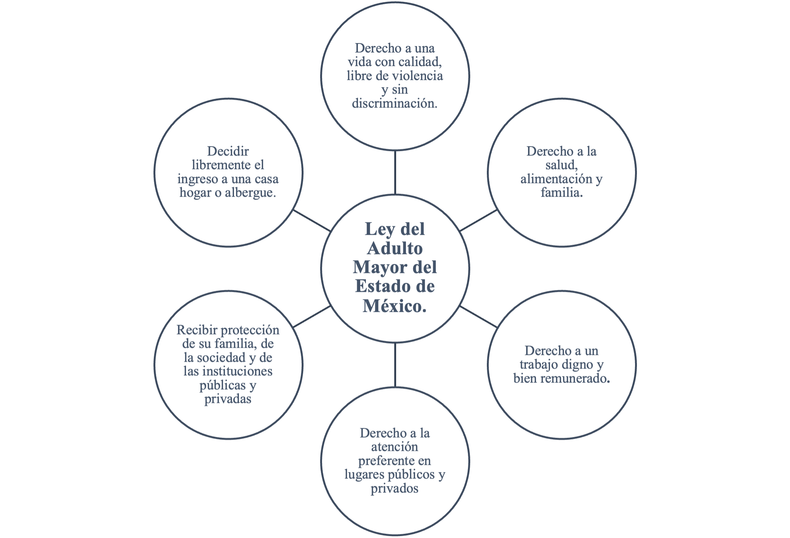

---
# Metadatos ESENCIALES del capítulo (no repetitivos)
pdf-engine: xelatex
title: "La asistencia institucional: el caso de la vejez en situación de calle en Naucalpan, Estado de México"
subtitle: ""

author:
  - name: "Julio César Rodríguez Dorantes"
    affiliation: "Escuela Superior de Ingeniería y Arquitectura, Campus Tecamachalco"
    orcid: ""  # Si lo proporcionan; si no hay info se puede borrar
    email: ""  # Si lo proporcionan; si no hay info se puede borrar 
    correspondence: true #Si no hay correo, se puede borrar

# Metadatos ESPECÍFICOS del capítulo (no centralizables)
chapter-number: "8"
page-range: ""  # Ajustar según paginación final
doi: ""  # DOI del capítulo (cuando se asigne)

# Contenido del capítulo
resumen: |
  El artículo examina las dinámicas y tensiones en torno a las políticas públicas dirigidas a adultos mayores en situación de calle en Naucalpan, Estado de México, enfocándose en la operación de instituciones como el DIF y el INAPAM. Utilizando un enfoque etnográfico y entrevistas con trabajadores sociales, se revela cómo las políticas públicas, aunque existentes desde 1979, sufren de problemas estructurales, como criterios asistencialistas, burocracia y una cobertura fragmentada, que excluyen a este grupo vulnerable. El estudio destaca las limitaciones de las instituciones, evidenciando barreras burocráticas y falta de recursos que perpetúan la exclusión de los adultos mayores en situación de calle. A pesar de la empatía de algunos trabajadores sociales, el sistema asistencialista mantiene a estos individuos en dependencia. Se propone replantear los programas desde un enfoque de derechos, buscando una atención más integral que aborde tanto las necesidades materiales como los problemas estructurales que enfrentan.

keywords:
  - "Asistencia Institucional"
  - "Exclusión"
  - "Indigencia"
  - "Vejéz"

# Tipo de documento
type: chapter

---

\addtocontents{toc}{\protect\hspace{1.5em} Julio César Rodríguez Dorantes \par}
\markboth{Asistencia Institucional y Vejéz en situación de Calle}{}

\begin{flushright}
\Large Julio César Rodríguez Dorantes \footnote{SEMBLANZA}
\end{flushright}

## Introducción {.unnumbered .unlisted}

El presente artículo tiene como objetivo presentar las dinámicas cotidianas y las tensiones en torno a las políticas públicas que afectan a los adultos mayores en situación de calle en Naucalpan, Estado de México. A través de un enfoque etnográfico, se explora cómo operan las instituciones en la vida diaria de estos adultos mayores, principalmente el DIF y el INAPAM, quienes brindan atención y apoyo integral, ofreciendo servicios básicos como alimentación y salud. Además, promueven el acceso a derechos, la inclusión social y la autonomía, buscando mejorar su calidad de vida y garantizar su protección.

Se consideran las diferencias entre quienes reciben apoyo institucional y quienes viven en la calle, así como la forma en que los trabajadores sociales perciben y abordan esta problemática. En México, las políticas públicas dirigidas al bienestar de los adultos mayores han evolucionado de manera significativa, reflejando los cambios sociales, económicos y políticos del país. La institucionalización del bienestar para este sector poblacional se remonta a 1979 con la creación del Instituto Nacional de la Senectud (INSEN). Posteriormente, en 2002, esta entidad experimentó un proceso de transformación, cambiando su nombre a Instituto Nacional de las Personas en Plenitud (INAPLEN) y fortaleciendo su vínculo con la Secretaría de Desarrollo Social. Como resultado de este proceso, el Instituto Nacional de las Personas Adultas Mayores (INAPAM) se consolidó como la principal institución encargada de promover y garantizar el bienestar de las personas mayores de 60 años, operando en conjunto con el Sistema Nacional para el Desarrollo Integral de la Familia (DIF). Sin embargo, a pesar de la relevancia de este aparato institucional en la atención a los adultos mayores, enfrenta limitaciones estructurales que dificultan su efectividad.

En este contexto, la vejez en situación de calle representa una de las expresiones más evidentes de las limitaciones en el Estado de México. En particular, en Naucalpan, este sector que habita y sobrevive en el espacio público enfrenta una realidad agravada por la falta de redes familiares y la ausencia de políticas públicas que garanticen una vejez digna. Aunque existen programas de desarrollo social enfocados en atender a poblaciones en riesgo, la implementación de estos mecanismos suele estar mediada por criterios asistencialistas y procesos burocráticos que limitan su impacto real. Por ello, esta investigación se plantea la siguiente **pregunta** guía: ¿Cómo operan las instituciones que ofrecen asistencia a los adultos mayores en situación de calle?

Para responder esta pregunta, se llevó a cabo una **metodología** cualitativa basada en observación y entrevistas fugaces con algunos trabajadores de estas instituciones, quienes interactúan de manera directa con los adultos mayores en situación de vulnerabilidad. Es importante señalar que este artículo no incluye trabajo de campo directo con los adultos mayores en situación de calle, ya que dicha labor fue realizada en investigaciones previas[^cap8_1]. No obstante, los hallazgos de este estudio se basan en la observación de las prácticas institucionales y en las entrevistas realizadas con los trabajadores sociales, quienes tienen contacto con este sector vulnerable.

[^cap8_1]: Imaginar y vivir una vejez digna: indigencia y espacios públicos en Naucalpan, Estado de México (2024)

    Adultos mayores de Naucalpan: percepciones sobre el estado, la familia y la sociedad desde la indigencia (2024)

El trabajo de campo realizado con los trabajadores de las instituciones permite profundizar en las dinámicas institucionales que afectan la implementación de políticas públicas para la atención a los adultos mayores en situación de calle. Este análisis busca reflexionar sobre las tensiones entre las intenciones de las políticas institucionales y la realidad de los adultos mayores que quedan fuera de su alcance. A través de esta investigación, se busca comprender las diferencias entre los adultos mayores que cuentan con el apoyo de programas institucionales y aquellos que viven en situación de calle, quienes no son suficientemente atendidos por el sistema. Estas diferencias revelan la fragmentación y limitación de las políticas públicas dirigidas a este grupo vulnerable.

El artículo está estructurado de la siguiente manera: **primero**, se presenta un acercamiento teórico que contextualiza la asistencia institucional, exclusión social e indigencia en la vejez, En **segundo** lugar, se aborda el acercamiento al campo, donde se describe la metodología empleada con los trabajadores del DIF. **Finalmente**, se ofrecen algunas reflexiones finales sobre los hallazgos, las implicaciones de las políticas públicas actuales y propuestas para mejorar la atención a los adultos mayores en situación de calle.

## Un acercamiento teórico a las estructuras institucionales {.unnumbered .unlisted}

En este apartado, se abordan tres categorías principales: asistencia institucional, exclusión social e indigencia en la vejez, situándose en la intersección entre la antropología institucional y la agenda pública. Para desarrollar estas categorías, se retoman los planteamientos de diversos autores con el fin de analizar las instituciones desde su dimensión operativa y comprender cómo la agenda pública permea la vida de sus beneficiarios. Un **acercamiento teórico a las estructuras institucionales** es fundamental porque permite comprender cómo operan, se configuran y transforman las instituciones en la sociedad mexiquense.

En primer lugar, Ricardo López Salazar, en su ensayo sobre "bienestar y desarrollo: evolución de dos conceptos asociados al bien vivir" (2019), examina los fundamentos y limitaciones de las políticas de protección social, proporcionando un marco teórico esencial para comprender la asistencia institucional desde la perspectiva Titmuss (1987). En la misma línea, Amartya Sen, en "Desarrollo y Libertad" (1999), enfatiza la importancia de ampliar las capacidades humanas como eje central del desarrollo, lo que permite reflexionar sobre el impacto de las políticas sociales en la vida de los adultos mayores.

Por otro lado, Robert Castel, en "La Inseguridad Social: ¿Qué es estar protegido?" (2004), profundiza en las dinámicas de vulnerabilidad y desprotección en las sociedades modernas, un enfoque clave para entender la exclusión social en la vejez. De manera complementaria, Asimismo, María Cristina Bayón, en su propuesta "Una sociología de la pobreza: la relevancia de las dimensiones culturales" (2014), señala cómo los programas sociales, aunque buscan combatir la exclusión, terminan reproduciendo desigualdades estructurales. Desde una perspectiva latinoamericana, Por otro lado, Emilio Fanfani, en "Estado y Pobreza" (1989), analiza el impacto de la exclusión en diversos sectores y examina el papel de las instituciones en América Latina.

En conjunto, estos autores y sus planteamientos permiten un análisis profundo sobre la asistencia institucional y la exclusión en la vejez en Naucalpan, Estado de México. A partir de sus enfoques teóricos, este estudio busca comprender cómo las instituciones operan en la práctica y de qué manera sus políticas afectan, directa o indirectamente, a los adultos mayores en situación de calle.

### Asistencia institucional {.unnumbered .unlisted}

Los programas de desarrollo social han intentado abordar la vejez principalmente a través de medidas económicas y la provisión de servicios básicos. Sin embargo, iniciativas como la *Pensión para el Bienestar de las Personas Adultas Mayores* no han logrado cumplir su objetivo de erradicar la vulnerabilidad extrema de los adultos mayores en situación de calle, quienes no son beneficiarios de dicho apoyo. Este enfoque teórico busca reflexionar sobre los vacíos institucionales en los esfuerzos por garantizar una vejez digna a la población de Naucalpan incluyendo a los adultos mayores en situación de calle, destacando las limitaciones de las políticas públicas actuales.

La propuesta de Ricardo López (2019), en su artículo *"Bienestar y desarrollo: evolución de dos conceptos asociados al bien vivir"*, ofrece una perspectiva teórica para analizar lo que aquí se discute el papel de la asistencia institucional en la vejez en situación de calle en Naucalpan, Estado de México. El autor explora la relación entre los conceptos de bienestar y desarrollo, lo que permite contrastarlos con la realidad de los adultos mayores en situación de calle "el bienestar es un concepto en constante construcción, sobre todo por su naturaleza ligada al desarrollo concreto de una sociedad específica. En este menester, el desarrollo emerge como un complemento al bienestar, en el sentido de su asociación en la misma dirección" (López, 289: 2019). Este análisis resulta clave para comprender cómo estos conceptos son operativizados en la agenda pública y cómo se reflejan en la aplicación de los programas sociales en el Estado de México. A través de esta perspectiva, es posible evaluar hasta qué punto las políticas actuales logran responder a las necesidades de esta población vulnerable o si, por el contrario, perpetúan dinámicas de exclusión y marginalización.

El autor afirma a lo largo de su investigación que el bienestar no es un concepto estático, sino que está en constante transformación y construcción social, variando según el contexto histórico, así como las condiciones sociales y económicas "ambos, son conceptos en constante construcción, asociados al devenir de una sociedad específica con sus problemas y retos. Por lo que, como constructos sociales complementarios, persiguen el bien vivir de las personas. Por lo que, en esencia, el desarrollo significa qué y cuáles características asociadas a la vida, debe de poseer una persona o familia para poder considerar vive bien en un contexto determinado" (López, 288: 2019). Para el caso de nuestra investigación, esta propuesta resulta pertinente, pues permite comprender que las nociones de bienestar en la agenda pública pueden no coincidir con las necesidades reales de los adultos mayores. Los programas de ayuda institucional suelen enfocarse en proveer recursos materiales, pero a menudo desatienden dimensiones subjetivas del verdadero bienestar social, como la dignidad en la vejez.

El autor problematiza el concepto de desarrollo, señalando que, si bien tradicionalmente se ha asociado con el crecimiento económico y la modernización, las perspectivas más recientes lo vinculan con la idea del bien vivir. En este sentido, el desarrollo en la vejez no debe medirse únicamente en términos de acceso a bienes y servicios, sino en función de la posibilidad de que los adultos mayores tengan una participación activa y funcional en la sociedad. En el contexto de la vejez en situación de calle, este enfoque pone en evidencia la exclusión estructural que experimentan estas personas, cuya marginalidad refleja las deficiencias en los modelos de desarrollo y en los programas sociales.

En ese sentido, la asistencia institucional se presenta como un arma de doble filo: por un lado, parece ofrecer una respuesta inmediata a las necesidades básicas de los adultos mayores en situación de calle; por otro, reproduce relaciones de poder que limitan su autonomía y dignidad. El autor subraya que las políticas públicas de bienestar suelen estar condicionadas por lógicas administrativas y burocráticas que no consideran las particularidades de los beneficiarios

> El Estado omnipresente y ejecutor de manera discrecional, dónde, cuándo, cuánto y en qué invertir, se sustituyó por la visión del desarrollo humano, al posicionar como la inversión más redituable recae en las personas sobre las actividades y los sectores. Es decir, bien podemos señalar a dicho enfoque (desarrollo humano) como la inspiración detrás de los programas focalizados de transferencias económicas condicionadas implementados en México (bajo los nombres de Progresa, Oportunidades y recientemente, Prospera (López, 303: 2019).

En el caso de Naucalpan, el trabajo de campo sugiere que los programas de asistencia, aunque bien intencionados, frecuentemente perpetúan la dependencia y refuerzan los estigmas sobre la vejez y la vida en la calle, en lugar de promover estrategias de inclusión que permitan a los adultos mayores ejercer sus derechos plenamente " Desde la óptica del presente escrito, las nociones del bienestar y desarrollo, además de ser retomadas como elementos centrales en las agendas de política de cualquier gobierno intencionado de mejorar la calidad de vida de sus ciudadanos, deben de incorporar la premisa de construir programas y políticas desde abajo, diagnosticando problemas comunes a las sociedades y trazando acciones y soluciones de la mano de los ciudadanos" (López, 311: 2019).

En *Desarrollo y Libertad* (1999), Amartya Sen expone una propuesta del desarrollo que va más allá de la acumulación de recursos económicos, proponiendo un enfoque centrado en las libertades humanas "el desarrollo exige la eliminación de las principales fuentes de privación de libertad: la pobreza y la tiranía, la escasez de oportunidades económicas y las privaciones sociales sistemáticas" (Sen, 19: 1999).

Su teoría se fundamenta en la idea de que el bienestar de las personas depende de su capacidad para ejercer la libertad de elegir. Es decir, el autor afirma que el desarrollo debería estar vinculado a la libertad, entendida como la capacidad de elegir el propio bienestar "la libertad política y las libertades civiles son importantes directamente por sí mismas y no tienen que justificarse indirectamente por su influencia en la economía" (Sen, 33: 1999). Este concepto puede vincularse con la manera en que las políticas sociales y las instituciones encargadas de asistir a los adultos mayores en situación de calle pueden contribuir a generar una vejez digna.

El acceso a servicios básicos como la salud y la vivienda son elementos clave para evaluar cómo las instituciones fomentan o limitan estas libertades. Además, Amartya Sen resalta la idea de que las instituciones juegan un papel importante en el desarrollo, no solo en términos materiales, sino también en términos emocionales "existen dos razones distintas por las que tiene una importancia fundamental la libertad individual en el concepto de desarrollo, relacionadas, respectivamente, con la evaluación y la eficacia" (Sen, 34: 1999). En este sentido, durante el análisis etnográfico, se explora cómo el DIF contribuye al desarrollo o deterioro de este sector, ayudando o reproduciendo situaciones de vulnerabilidad. Así, se analiza lo que propone el autor en relación con la calidad de la asistencia institucional y su vínculo con los conceptos de libertad evaluación y la eficacia.

Del mismo modo, Amartya Sen cuestiona las desigualdades estructurales que limitan las libertades de los que deberían ser beneficiados. Este aspecto es clave en la investigación que aquí se discute, ya que la vejez en situación de calle es una manifestación de la desigualdad y la marginalidad urbana. El autor resalta la importancia de abordar la desigualdad que afecta las capacidades de los sujetos y cómo las políticas públicas deben centrarse en mejorar estas capacidades. En este contexto, se afirma que la desigualdad que enfrentan los adultos mayores en situación de calle, en comparación con aquellos que cuentan con lazos sociales y vivienda, no se reduce a través de las políticas implementadas.

Además, Amartya Sen hace énfasis en destacar la importancia de que las personas no solo tengan acceso a recursos, sino también la capacidad de formar parte de las decisiones que se toman para generar su bienestar. En este sentido, es crucial señalar que los adultos mayores en situación de calle no solo son excluidos, sino que también son invisibilizados.

En la propuesta de Amartya Sen se rescata la idea de que el bienestar debe medirse en términos de las necesidades y capacidades de las personas beneficiadas por los programas. Esto nos lleva a cuestionar si las políticas implementadas por los gobiernos proveen los servicios básicos necesarios y aumentan las probabilidades de tener una vejez digna. Por lo tanto, las ideas de Sen contribuyen al análisis de la investigación, permitiendo cuestionar si las intervenciones institucionales son realmente transformadoras o, por el contrario, refuerzan las desigualdades y limitaciones que enfrentan los adultos mayores en esta situación.

Como se ha mencionado a lo largo del texto, la presencia de adultos mayores en situación de calle se ha convertido en un fenómeno cada vez más invisibilizado. En este sentido, resulta preocupante que, en Naucalpan, las dinámicas de exclusión social, la pobreza estructural y la falta de redes de apoyo hayan llevado a un número importante de personas mayores a habitar los espacios públicos en condiciones de vulnerabilidad extrema. Ante esta problemática, surgen interrogantes fundamentales sobre el papel que desempeñan las instituciones gubernamentales en la protección y garantía de los derechos de este sector. Para abordar esta cuestión, es pertinente retomar lo planteado por Robert Castel (2004) en *La Inseguridad Social: ¿Qué es estar protegido?*, donde desarrolla un análisis profundo sobre la fragilidad de la vida en las sociedades contemporáneas " una sociedad de individuos no sería ya, hablando con propiedad, una sociedad sino un derecho de naturaleza, es decir, un estado sin ley, sin derecho, sin constitución política y sin instituciones sociales, presa de una competencia desenfrenada de los individuos entre sí, y de la guerra de todos contra todos" ( Castel,19: 2004).

Según el autor, la deficiencia del Estado y sus políticas de bienestar han intensificado la precarización de la vida urbana, lo que agrava la situación de quienes se encuentran en condiciones de desprotección "una sociedad de inseguridad total. Liberados de toda regulación colectiva, los individuos viven bajo el signo de la amenaza permanente porque no poseen en sí mismos el poder de proteger y de protegerse" (Castel,19: 2004). Desde esta perspectiva, el enfoque de Castel resulta relevante para comprender la situación de los adultos mayores en situación de calle, ya que permite reflexionar sobre cómo la pérdida de redes sociales, económicas y emocionales los coloca en un estado de vulnerabilidad extrema.

En este sentido, el autor describe cómo la falta de seguridad social surge cuando los individuos quedan desprotegidos frente a los riesgos del entorno urbano debido a la ausencia de un compromiso institucional efectivo. Cabe destacar que las instituciones, históricamente, han estado obligadas a garantizar cierta estabilidad; sin embargo, en el caso de Naucalpan, la invisibilización de los adultos mayores en el espacio público es producto de una serie de rupturas estructurales. Bajo esta lógica, la vejez en situación de calle puede interpretarse como la fase extrema de un proceso de desprotección que Castel describe como el paso de la "integración a la asistencia residual". "Dicho de otro modo, sigue habiendo inseguridad social, como sigue habiendo pobreza. Pero ambas pueden pensarse como residuales con respecto a la dinámica que parece imponerse" (Castel,49: 2004). En este punto, el autor sostiene que las personas terminan dependiendo de una ayuda que, lejos de ser eficiente, resulta insuficiente para garantizar su bienestar.

El autor señala que, en lugar de resolver estructuralmente la vulnerabilidad social, muchas de las políticas públicas funcionan como mecanismos paliativos que, lejos de erradicar el problema, mantienen a los beneficiarios en una zona de precariedad sin garantizar efectivamente su derecho al bienestar. En este sentido, en el caso de la asistencia institucional a la vejez en situación de calle, dicha lógica se traduce en programas que presentan diversas limitaciones. En primer lugar, el acceso a estos programas es restringido, ya que depende de criterios burocráticos difíciles de cumplir para una persona en esta condición, tales como la presentación de un comprobante de domicilio o un acta de nacimiento. En segundo lugar, el apoyo brindado suele centrarse en soluciones temporales, como la provisión de albergues o la entrega de alimentos, sin abordar de manera integral las causas estructurales del problema.

Asimismo, es importante destacar que, en muchos casos, estos programas no solo resultan insuficientes, sino que también reproducen discursos paternalistas que terminan por estigmatizar aún más la situación de los adultos mayores en condición de calle. Si bien existen iniciativas del DIF como la atención integral gerontológica, los centros de día, los albergues, las campañas contra el maltrato, los programas alimentarios y la promoción de la participación social, y por parte del INAPAM programas de credencialización, actividades de envejecimiento activo, vinculación intergeneracional y descuentos en bienes y servicios, estas acciones suelen estar diseñadas bajo una lógica asistencialista que prioriza la protección pasiva por encima de la autonomía y la agencia de las personas mayores, lo que limita el alcance real de su impacto en contextos de alta vulnerabilidad. De este modo, en lugar de promover una política de inclusión y derechos, se refuerza la percepción de que estas personas dependen exclusivamente de la caridad estatal, sin reconocer su autonomía ni sus necesidades específicas. Desde la perspectiva del Castel, este tipo de asistencia refuerza lo que él denomina "zona de vulnerabilidad", en las que las personas no están completamente excluidas del sistema, pero tampoco logran gozar de los derechos y garantías. Esta situación es evidente en el caso de los adultos mayores en situación de calle, quienes pueden recibir apoyos ocasionales, pero no cuentan con un marco institucional sólido que les garantice estabilidad y bienestar. El análisis de Robert Castel permite comprender la vejez en situación de calle no como una condición estática, sino como el resultado de un proceso de vulnerabilización estructural en el que convergen la falta de seguridad social, la fragmentación de redes de apoyo y la insuficiencia de las políticas públicas.

Desde esta perspectiva, el análisis etnográfico de la asistencia institucional en Naucalpan debe centrarse en varios aspectos. En primer lugar, es fundamental identificar los mecanismos a través de los cuales este sector ha sido progresivamente olvidado. En segundo lugar, es necesario examinar cómo las políticas existentes, lejos de ofrecer soluciones estructurales, perpetúan la precariedad de los adultos mayores en situación de calle. En ese sentido, resulta esencial analizar las experiencias y percepciones de las personas afectadas para visibilizar las barreras que enfrentan en su acceso a los derechos y recursos institucionales.

Según María Cristina Bayón (2014) señala que los programas sociales, aunque diseñados para combatir la exclusión, terminan reproduciendo desigualdades "Los pobres pueden ser considerados desviados y peligrosos, apáticos y pasivos, o visualizados como luchadores heroicos que enfrentan cotidianamente carencias y privaciones; en todos los casos somos nosotros lo que deberíamos hacer algo por ellos" (Bayón, 2014: 362). La autora ofrece una perspectiva útil para analizar los programas de desarrollo social al examinar cómo operan en contextos de exclusión estructural. En particular, destaca que la construcción de la pobreza como categoría política responde más a objetivos administrativos que a las realidades de la vida cotidiana de los beneficiarios.

En este sentido, la representación de la vejez en situación de calle dentro de la agenda pública no solo refleja las experiencias de vida de los adultos mayores, sino que también las distorsiona. Existe un mecanismo de control social, ya que, según Bayón, los programas de asistencia funcionan como dispositivos de regulación que normalizan ciertas formas de vida y, al mismo tiempo, marginalizan y estigmatizan otras "La construcción del pobre como el otro, así como la estigmatización de que es objeto, es relacional y dependiente del contexto" (Bayón, 2014: 362). Así, las prácticas institucionales enfocadas en personas mayores en situación de calle refuerzan, pero también desafían, las dinámicas de exclusión y control.

Además, la autora subraya que el acceso a los programas sociales no es homogéneo, sino que está mediado por relaciones de poder y discriminación "los programas de "combate" a la pobreza aplicados durante los últimos veinte años, que "suponen" que los pobres no están incorporados al mercado de trabajo, opacando las condiciones estructurales de funcionamiento del mismo, que, lejos de permitir escapar de la pobreza es uno de los principales factores que contribuyen a perpetuarla" (Bayón, 2014: 367). En esta línea, se afirma que las personas en situación de calle enfrentan múltiples barreras para acceder a los recursos y apoyos que ofrece el Estado. En muchos casos, la falta de documentos de identidad les impide ser reconocidos como ciudadanos con derechos, lo que dificulta su incorporación a los esquemas de protección social.

Este fenómeno también se vincula con la tensión entre dignidad y caridad. Según Bayón, la caridad genera lazos de dependencia, lo que refuerza una visión asistencialista que no contribuye a la autonomía de las personas beneficiarias "la imagen de los receptores de programas sociales responde a estereotipos clasistas, sexistas y racistas, que tiende a culpabilizar a los pobres por su situación, y las referencias a dimensiones estructurales (mercado de trabajo, desigualdad, provisión de servicios, etcétera) son casi inexistentes; el eje no suele ser la eliminación de la pobreza ni sus causas, sino la dependencia de los programas sociales" (Bayón, 2014: 368). Esta problemática se relaciona directamente con la investigación aquí planteada sobre *vejez y calle*, ya que las políticas actuales no favorecen la integración social de los adultos mayores sin hogar.

En este contexto, resulta crucial analizar y cuestionar este modelo de asistencia social, explorando cómo se concibe el bienestar dentro de las políticas públicas. Es fundamental reflexionar sobre cómo estas concepciones, en muchas ocasiones, tienden a minimizar las necesidades reales de los adultos mayores en situación de calle. En lugar de reconocerlos como sujetos activos con derechos, capaces de aspirar a una vejez digna, se perpetúan enfoques que reducen su participación en la sociedad y limitan su acceso pleno a oportunidades.

Emilio Fanfani (1989), en su obra *Estado y Pobreza*, reflexiona sobre la relación entre el Estado y los sectores más vulnerables de la población, en particular los pobres. El autor señala cómo las políticas públicas, aunque a menudo diseñadas con la intención de erradicar la pobreza, no siempre logran su objetivo, ya que el mismo sistema económico y político es quien perpetúa la pobreza "Desde sus orígenes el Estado moderno instala una serie de instituciones especializadas en intervenir sobre necesidades específicas de los sectores tradicionales tipificados como "pobres". Estos constituyen el objeto preferencial de la política social del Estado. Con el paso del tiempo, y en función de ciertos desarrollos en la base material de la sociedad, la dialéctica clase sociales - Estado da lugar a la conformación de sistemas especializados de prestación de servicios sociales" (Fanfani, 9: 1989). Por lo tanto, es posible que esta dinámica también incida en la ineficacia de las políticas de asistencia en Naucalpan, Estado de México.

El autor aborda la pobreza desde un enfoque estructural, afirmando que las soluciones a la pobreza no deben centrarse únicamente en lo inmediato, sino también en las causas estructurales que la originan. "Esta característica de discrecionalidad y autonomía de la política respecto de la pobreza parece ser una característica crónica del capítulo de las políticas públicas dirigidas a intervenir en forma directa y global sobre los sectores sociales más desfavorecidos" (Fanfani, 20: 1989). En este sentido, se sostiene que la pobreza es el resultado de la estructura económica y social del Estado, que excluye y estigmatiza a ciertos grupos. Así, la pobreza no es solo una cuestión de falta de recursos, sino también de acceso desigual a derechos, oportunidades y servicios.

Para Emilio Fanfani, los programas de desarrollo social que adoptan un enfoque paliativo, como la asistencia temporal, tienden a ser reactivas en lugar de preventivas "En especial, la introducción de un conjunto de especialistas que actúan desde los puestos centrales de las organizaciones y programas asistenciales que no tienen que ver con los sujetos sino con grandes cifras abstractas (beneficiarios, recursos, gastos, costos, etc.). No sólo esto, sino que se tiende a trabajar con poblaciones construidas mediante procedimientos técnicos y estadísticos" (Fanfani, 20: 1989). Estas políticas, al no abordar las estructuras que generan la pobreza, se limitan a ofrecer soluciones superficiales y no contribuyen a la transformación de las condiciones subyacentes. De este modo, la asistencia social se ve como un "parche" que no resuelve las causas fundamentales de la pobreza. Además, esta asistencia puede contribuir a la "reproducción" de la pobreza, al no ofrecer las herramientas necesarias para que las personas en situación de vulnerabilidad puedan superar su situación.

Al analizar la pobreza en el contexto de los adultos mayores en situación de calle en Naucalpan, se retoma la propuesta de Emilio Fanfani, quien realiza una crítica hacia las políticas de asistencia institucional que, con frecuencia, no abordan las causas estructurales de la marginación de este grupo. La pobreza extrema en la vejez, especialmente para aquellos que viven en la calle, es un claro ejemplo de cómo la asistencia social muchas veces se limita a intervenciones superficiales que no atacan los problemas profundos de exclusión social, desprotección en la salud o la falta de oportunidades para una vejez digna. Tal como lo afirma el autor, se sigue la idea de que las políticas dirigidas a poblaciones vulnerables, como los adultos mayores en situación de calle, a menudo se limitan a la provisión de ayuda temporal (albergues, alimentación) sin contemplar los procesos de integración a la sociedad ni soluciones sostenibles a largo plazo. Esto crea un ciclo de dependencia, sin permitir que estas personas puedan alcanzar una mayor autonomía o mejorar su situación de vida. El análisis de Emilio Fanfani ayuda a reflexionar sobre cómo las políticas públicas en Naucalpan, Estado de México, pueden contribuir a una especie de "pobreza crónica" para los adultos mayores en situación de calle. Las soluciones de corto plazo, como los albergues temporales, podrían ser insuficientes para cambiar las estructuras sociales que han llevado a este grupo a la marginalidad.

Ahora bien, en este apartado se expuso un andamiaje de gran importancia para comprender las dinámicas de asistencia social institucional. Los aportes de López Salazar, Amartya Sen, Robert Castel, María Cristina Bayón y Emilio Fanfani coinciden en la necesidad de analizar las políticas públicas no solo en el diseño, sino también el impacto en la vida cotidiana de los beneficiarios de dichos programas. En particular se resalta las importancias de las capacidades humanas planteada por Amartya Sen como eje de bienestar, lo que dialoga con la propuesta de Robert Castel sobre la inseguridad social. Del mismo modo, las propuestas de Bayón y Fanfani evidencian cómo, en contextos latinoamericanos, las políticas asistenciales suelen reproducir desigualdades estructurales, aun cuando buscan mitigar la pobreza.

Este marco teórico no solo orienta el análisis de la asistencia institucional y la exclusión social, sino que también permite problematizar el papel de las instituciones en la vida de los adultos mayores en situación de calle. A partir de estas perspectivas, el estudio se propone visibilizar las tensiones entre la agenda pública, las políticas de bienestar y las realidades que enfrentan los beneficiarios, contribuyendo así a una reflexión crítica sobre la vejez, la indigencia y la acción institucional en el contexto de Naucalpan, Estado de México. Con estos antecedentes teóricos, se da paso al análisis de los estudios de caso, a través del trabajo de campo donde se examinan las experiencias concretas de los diferentes actores sociales evidenciando cómo las políticas y programas sociales se materializan en su vida cotidiana.

**Etnografía**

El trabajo de campo realizado en Naucalpan, Estado de México, evidencia las complejidades que enfrentan las instituciones encargadas de brindar asistencia social. Dependencias como el Sistema Nacional para el Desarrollo Integral de la Familia (DIF) y el Instituto Nacional de las Personas Adultas Mayores (INAPAM) están diseñadas para mejorar la calidad de vida de la población vulnerable, enfocándose en áreas como la salud y la recreación. Sin embargo, desde un enfoque etnográfico, se observa que los discursos oficiales están cargados de contradicciones entre lo que se declara y lo que realmente se implementa.

Para llevar a cabo esta investigación, se utilizó una metodología etnográfica basada en la observación y entrevistas informales con funcionarios de estas instituciones. Se realizaron recorridos dentro de sus oficinas con el fin de comprender cómo operan internamente y cómo se materializan las políticas públicas en la práctica. En algunos casos, la observación se llevó a cabo de manera anónima, asumiendo la posición de un usuario más lo que permitió registrar de primera mano las dinámicas de atención, los obstáculos burocráticos y las respuestas institucionales sin la mediación de discursos oficiales.

Adoptar una mirada etnográfica dentro de los órganos de gobierno permitió comprenderlos como espacios vivos de interacción social, donde emergen tanto tensiones estructurales como conflictos humanos. Esta etnografía no solo visibiliza las fallas del sistema institucional, sino que también permite identificar las dinámicas invisibles que moldean la formulación y ejecución de políticas desde dentro. El análisis se sustentó en la etnografía densa propuesta por Clifford Geertz (1973), permitiendo interpretar los significados detrás de las prácticas burocráticas y la forma en que estas configuran el funcionamiento institucional. A través de esta metodología, se logró evidenciar cómo las tensiones estructurales y humanas dentro de las instituciones impactan en su capacidad de respuesta.

## Entre discursos y prácticas {.unnumbered .unlisted}

> *Si el gobierno protegiera a los adultos mayores en situación de calle, no solo cuidaría vidas, sino también memorias, experiencias y dignidades.*
>
> *(idea propia surgida en el trabajo de campo 2024)*

Desde que inició el trabajo de campo en julio 2024 a febrero 2025, note una evidente contradicción entre el discurso oficial de las instituciones encargadas de la asistencia a adultos mayores como el DIF y el INAPAM y las practicas reales que estos organismos implementan. El discurso institucional proyecta una narrativa centrada en la protección y dignificación de la vida de los adultos mayores en extrema vulnerabilidad, presentando programas y políticas orientadas al bienestar, la inclusión y la restitución de sus derechos. Sin embargo, la observación y las entrevistas fugaces han revelado que estas intenciones se deterioran al enfrentarse a la burocracia institucional. Los trabajadores, quienes en algunas ocasiones muestran cierto grado de empatía, están inmersos en dinámicas administrativas rígidas que impiden una intervención efectiva. Las actividades burocráticas y poco criterio de elegibilidad, así como falta de personal con las herramientas adecuadas contribuyen a generar barreras entre el bienestar y la realidad de los adultos mayores en condiciones de vulnerabilidad extrema.

Durante el trabajo de campo, se observó que el refugio permanente es una necesidad primordial además de atención médica y alimentación, sin embargo, estas atenciones humanas se diluyen entre procesos administrativos que solo buscan llenar expedientes. Este desfase entre las necesidades reales y la respuesta institucional genera una sensación de frustración tanto para los adultos inmersos en esta situación vulnerable como algunos de los trabajadores sociales, quienes, a pesar de sus buenas intenciones, terminan reproduciendo dinámicas de exclusión. El trabajo de campo me permitió evidenciar la brecha burocrática entre la vida real y las buenas intenciones institucionales. El dignificar la vejez queda en un discurso cuando las prácticas cotidianas en la oficina refuerzan la marginalización, mostrando que la asistencia social se convierte en un mecanismo de control más que un puente de integración sociocultural.

IMAGEN 1.- El esquema representa un conjunto de derechos fundamentales para los adultos mayores establecidos en un marco legal que busca garantizar su bienestar. Desde una mirada etnográfica refleja un marco normativo bien intencionado, pero en la práctica, los adultos mayores enfrentan múltiples barreras para acceder a estos derechos.

**Fuente: Elaboración propia del banco de datos de la página web**

[**https://dif.naucalpan.gob.mx**](https://dif.naucalpan.gob.mx)

Un ejemplo de esta contradicción se presenta cuando los empleados mencionan la dificultad de ofrecer apoyo a aquellos que carecen de documentos oficiales, lo que se convierte en un obstáculo importante para acceder a los servicios sociales. Le pregunte que pasaba si un adulto mayor en situación de calle se acerca para solicitar apoyo me dijo "Sin papeles no podemos apoyarlos al sistema. Si quiere ayuda, primero tiene tramitar su acta de nacimiento". Este episodio evidencia una contradicción estructural dentro del sistema de asistencia social: existe presencia institucional y voluntad de brindar ayuda, pero al mismo tiempo, los criterios administrativos como la exigencia de documentos oficiales se convierten en barreras que excluyen a los más vulnerables, como los adultos mayores en situación de calle. La necesidad de cumplir con ciertos protocolos burocráticos como la validación de documentos o el cumplimiento de requisitos específicos para ser aceptado en los programas se convierte en una barrera para aquellos que ya se encuentran en situaciones de extrema vulnerabilidad. Esto crea una fractura entre lo que las instituciones prometen ofrecer y lo que realmente pueden proporcionar, lo cual genera una paradoja: las políticas y programas están diseñados para asistir a los más vulnerables, pero se encuentran restringidos por un sistema rígido que, en lugar de facilitar la ayuda, se convierte en un obstáculo.

Además, la estructura burocrática parece funcionar como un filtro, donde los adultos mayores en situación de calle, muchas veces sin documentos, son considerados casi "invisibles" ante las instituciones encargadas de su atención. Esto nos lleva a una reflexión crítica sobre la naturaleza de los servicios públicos y su capacidad para adaptarse a las realidades cotidianas de las personas a las que supuestamente deben servir. En muchos casos, las instituciones no logran conectar con las necesidades urgentes y específicas de los individuos, ya que se limitan a cumplir con un conjunto de requisitos formales sin comprender completamente las circunstancias de cada caso.

### Empatía y Limitaciones en la Asistencia {.unlisted .unnumbered}

En la oficina de Trabajo Social, logré hablar con una asistente social. Me identifiqué como investigador, buscando entender cómo el DIF atendía a adultos mayores en situación de calle. Entonces menciono "estamos limitados por las reglas para ello, solo canalizamos a un asilo"

Su respuesta resonó en mi mente. "sin papeles, no existen". La lógica burocrática convierte a los adultos mayores sin hogar en sujetos invisibles, ajenos a los derechos que, en teoría, deberían ser universales. Los trabajadores del DIF, aunque expresan un fuerte deseo de ayudar, reconocen que sus capacidades están rebasadas por la cantidad de personas que requieren asistencia. La falta de recursos y espacios disponibles es una constante en sus relatos. Estando en la oficina mire el reloj y marcaba las 1:30 pm una hora que marca el umbral de la oficina ya que los empleados están con el dilema de qué comerán en la hora de la comida. Las fachadas de color gris con una arquitectura funcional para brindar bienestar a la comunidad contrasta con el concreto desnudo reflejando la frialdad institucional que había leído en algunos otros textos antropológicos.

A pesar de la hora la persona responsable del área era muy amable y prestaba atención a mis preguntas sentado frente a ella y cuaderno en mano le pregunte *¿Cree que las políticas actuales son suficientes para atender a los adultos mayores que están calle?* Y en un tono amable menciono "contamos con un asilo, solo tiene la capacidad para atender a 20 personas, y no siempre hay recursos para recibir a quienes llegan". Esta afirmación reflejaba la profunda limitación de los recursos disponibles, una limitación que no solo afecta la cantidad de personas que pueden recibir ayuda, sino que también afecta la calidad de la atención brindada. Esta falta de recursos se convierte en una fuente constante de frustración tanto para los trabajadores como para las personas que buscan ayuda, quienes se ven rechazadas o desplazadas en su necesidad de asistencia.

Lo que se destaca a lo largo del trabajo de campo es la imposibilidad de ofrecer un apoyo integral a los adultos mayores en situación de calle. A pesar de los esfuerzos del personal, las intervenciones tienden a ser reactivas y limitadas a medidas superficiales como proporcionar comida o un espacio temporal. Sin embargo, no existen programas que aborden las causas estructurales de la indigencia ni estrategias que permitan una integración social más duradera. Los trabajadores institucionales, aunque reconocen la importancia de su labor, también se sienten atrapados en un sistema que, más allá de sus intenciones, no se ajusta a las realidades concretas de las personas que intentan asistir.

El sentimiento de impotencia es una constante que aparece en los relatos de los trabajadores. Muchos expresan su frustración al no poder ofrecer soluciones definitivas a los problemas que enfrentan los adultos mayores en situación de calle, quienes se ven atrapados en un círculo vicioso de marginación y desprotección. Esta falta de respuestas efectivas, a pesar de la empatía de los trabajadores, subraya las limitaciones inherentes de un sistema que no ha sido diseñado para dar una respuesta adecuada a esta población específica.

### Exclusión Institucional y Percepción hacia los Adultos Mayores {.unlisted .unnumbered}

El análisis de las percepciones de los trabajadores del INAPAM y el DIF también reveló una clara exclusión institucional que afecta la atención a los adultos mayores en situación de calle. Aunque el INAPAM se presenta como una institución abierta a toda la comunidad, en la práctica opera de manera restrictiva, dejando fuera a aquellos que no cuentan con una vivienda estable ni documentos que avalen su derecho a recibir asistencia. Esta exclusión social se refleja en la vida cotidiana de los adultos mayores que viven en las calles de Naucalpan. A pesar de que existen espacios institucionales como el DIF 5 de mayo, DIF Arcos, Casa de día "Sonreír a la vida" o el INAPAM, la realidad es que las condiciones de acceso a estos lugares son limitadas por las burocracias internas y los protocolos administrativos. La falta de adaptabilidad de estos servicios para responder a las necesidades de los adultos mayores que no pueden cumplir con los requisitos establecidos (como la falta de documentos oficiales o la falta de un domicilio) expone la fragilidad del sistema de bienestar social.

Un testimonio clave de una trabajadora del DIF (2024) muestra esta tensión: "A los adultos mayores los vemos como personas que cargan con mucho peso de la sociedad, son abandonados por sus familias y, aunque nos gustaría hacer más por ellos, no tenemos los recursos para brindarles el apoyo que necesitan." Esta reflexión resalta el contraste entre las buenas intenciones de los trabajadores y las limitaciones estructurales que enfrentan dentro de un sistema incapaz de ofrecer respuestas efectivas. Además, la etnografía muestra otro desafío: la resistencia de algunos adultos mayores a recibir asistencia. Ya sea por desconfianza hacia las instituciones o por el deseo de mantener su autonomía, muchos prefieren rechazar la ayuda, incluso en condiciones de extrema marginalidad. Esta compleja relación entre las instituciones y los adultos mayores refleja una doble exclusión material, al no acceder a recursos básicos, y simbólica, al quedar fuera del sistema de protección social.

Algunos de los adultos mayores entrevistados relatan que las visitas a estas instituciones suelen ser breves e ineficaces, ya que no se le ofrece una solución sostenible a su situación[^cap8_2]. En muchos casos, la ayuda se limita a una intervención temporal como entregar comida o permitirles descansar por un breve periodo de tiempo, pero no se desarrollan programas de acompañamiento integral que garanticen una mejora duradera en su calidad de vida. A través de esta etnografía, se hace evidente que la atención institucional es insuficiente para abordar las complejas necesidades de los adultos mayores en situación de calle, lo que refuerza la percepción de que, a pesar de las intenciones, el sistema está fallando en proporcionar una solución adecuada.

[^cap8_2]: Adultos mayores de Naucalpan: percepciones sobre el estado, la familia y la sociedad desde la indigencia (2024)

La etnografía realizada revela una profunda brecha entre el discurso institucional y las practicas cotidianas en la atención y prevención a los adultos mayores en situación de calle. El DIF y el INAPAM, proyectan narrativas de protección y dignificación, pero en la práctica, la ayuda que ofrecen es limitada, burocratizada y, en muchos casos, ineficiente. Los testimonios recopilados durante el trabajo de campo evidenciaron estas afirmaciones. Algunos adultos mayores han expresado que no conocen el apoyo que estas instituciones pueden brindar. La asistencia social se reduce a la entrega de alguna cobija, la posibilidad de descansar algunas horas en un albergue, pero no se les ofrece un acompañamiento integral que aborde las causas estructurales de su situación.

Lo mencionado por una trabajadora del DIF destaca esta tensión: "a los adultos mayores los vemos como personas que necesitan mucho apoyo, no tienen a nadie, nos gustaría apoyar, pero no tenemos los recursos". Esta declaración es una constante entre los miembros de estos organismos. Además, el trabajo de campo muestra que la relación entre estas instituciones y los adultos mayores en situación de calle es compleja. Algunos no saben del apoyo que podrían recibir y otros la rechazan debido a la desconfianza hacia todas las personas que los rodean. Esta actitud refuerza el círculo de exclusión, donde los adultos mayores no solo enfrentan barreras materiales, sino también simbólicas, quedando "invisibles" ante el aparato burocrático. Esta visita al DIF dejó al descubierto más que procedimientos burocráticos ineficientes. Fue un retrato de cómo las instituciones replican violencias estructurales al no adaptar sus programas a realidades complejas. Los adultos mayores en situación de calle no solo enfrentan la pérdida de un hogar o redes familiares, sino también la negación simbólica de su derecho a existir dentro del sistema.

La estructura administrativa funciona como un filtro que excluye a quienes no cumplen con ciertos requisitos, como la posesión de documentos oficiales, reforzando lo que Pierre Bourdieu (1994) denomina "violencia simbólica "el autor describe que hay formas de dominación que operan de manera sutil legitimadas por el Estado. En el contexto de la asistencia institucional a adultos mayores en situación de calle en Naucalpan, la violencia simbólica se evidencia en prácticas que, bajo el discurso del cuidado y la protección, reproducen estigmas y jerarquías sociales. Así, las instituciones terminan perpetuando la marginalidad que intentan combatir, incapaces de adaptarse a las realidades cotidianas y urgentes de esta población vulnerable.

## Entre la institución y la realidad: reflexiones inconclusas  {.unlisted .unnumbered}

La investigación realizada en Naucalpan, Estado de México ha permitido evidenciar que la asistencia institucional a los adultos mayores en situación de calle enfrenta limitaciones estructurales y operativas. Aunque los programas sociales están diseñados para garantizar el bienestar de este sector, en la práctica, las barreras burocráticas, la falta de recursos y rigidez de los protocolos impiden una atención efectiva y digna. La vejez y la situación de calle es un fenómeno que pone en tensión el discurso oficial de las instituciones ya que las realidades cotidianas de exclusión y marginalización se hace presentes.

A través del trabajo de campo, se ha observado que la burocracia institucional opera como un mecanismo de filtrado que deja de fuera a quienes no cumplen con los criterios administrativos, reproduciendo una violencia simbólica que los condena a convertirse en sujetos invisibilizados. Si bien algunos trabajadores sociales muestran empatía, las restricciones de un sistema los limita en su capacidad de acción, consolidando un modelo de asistencia asistencialista que perpetua la dependencia de vivir en las calles y depender de la solidaridad de la sociedad. En ese sentido, esta investigación ha permitido problematizar la relación entre el Estado y la vejez en situación de calle, destacando la necesidad de repensar los programas de asistencia desde un enfoque de derechos. Los datos recopilados durante el trabajo de campo sugiere que las políticas públicas deben de dejar de lado la idea de ser asistencialista y optar estrategias integrales que atiendan no solo las necesidades de cubrir una agenda pública y material, sino también los problemas estructurales que perpetúan la vida en la calle de los adultos mayores.

Por lo tanto, en este trabajo se opta por dejar abiertas algunas líneas de reflexión mediante preguntas puntuales sobre el futuro de la asistencia social. ¿Es posible que los programas sociales garanticen una vejez digna a quienes, en su juventud, no lograron consolidar una vida laboral estable? Esta interrogante surge a partir de la premisa de que muchos adultos mayores en situación de calle enfrentan esta realidad debido a la falta de éxito y estabilidad en los ámbitos laboral, social y familiar a lo largo de su vida. ¿Cómo se puede apoyar a las personas sin identidad burocrática? Abordar este problema administrativo es fundamental, ya que muchas personas en situación de calle quedan excluidas de los programas sociales debido a la falta de documentos que acrediten su identidad. Esta ausencia no solo las margina del acceso a derechos básicos, sino que también las invisibiliza dentro del sistema. Por lo tanto, es crucial desarrollar políticas más inclusivas y eficientes que realmente transformen la vida social de estas personas, en lugar de limitarse a cumplir con un mecanismo institucional que solo simula brindar ayuda.

Bayón, M. C. (2013). Hacia una sociología de la pobreza: la relevancia de las dimensiones culturales. *Estudios Sociológicos*, 31(92), 87-112.

Bayón, M. C. (2014). La construcción del otro y el discurso de la pobreza: Narrativas y experiencias desde la periferia de la Ciudad de México. En *Universidad Nacional Autónoma de México* (pp. 357-376).

Bourdieu, P. (1994). Structures, habitus, power: Basis for a theory of symbolic power. En *Culture/power/history: A reader in contemporary social theory* (p. 155).

Castel, R. (1997). *La metamorfosis de la cuestión social*. Buenos Aires: Paidós.

Castel, R. (2014). *La inseguridad social: ¿Qué es estar protegido?* Buenos Aires: Ediciones Manantial.

Geertz, C. (2000). *La interpretación de las culturas* (Vol. 1). Barcelona: Gedisa.

Isuani, E., & Fanfani, E. T. (1989). Estado democrático y política social. Buenos Aires: EUDEBA.

Liboreiro, E. (1989). Participación. En *Diccionario de las Ciencias Sociales y Políticas*. Buenos Aires: Punto Sur.

Salazar, R. L. (2019). Bienestar y desarrollo: evolución de dos conceptos asociados al bien vivir. *Telos: Revista de Estudios Interdisciplinarios en Ciencias Sociales, 21*(2), 288-312.

Sen, A. (2000). El desarrollo como libertad. *Gaceta Ecológica, (55)*, 14-20.

**Por: Julio César Rodríguez Dorantes**

[**juldorantes\@gmail.com**](mailto:juldorantes@gmail.com)

**CATEDRA COMECYT**

**ESIA -- TECAMACHALCO del IPN**
